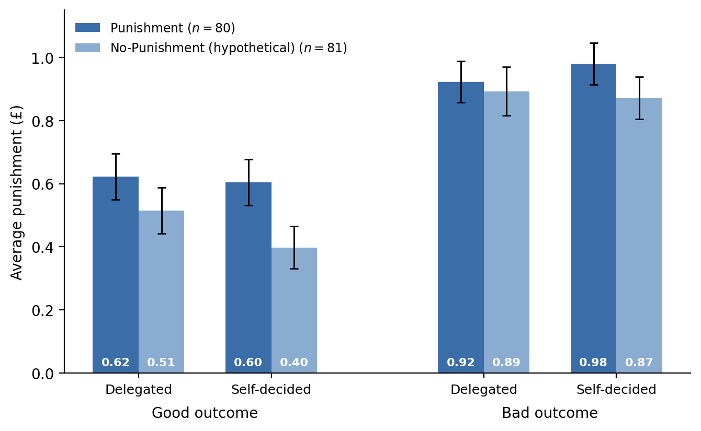
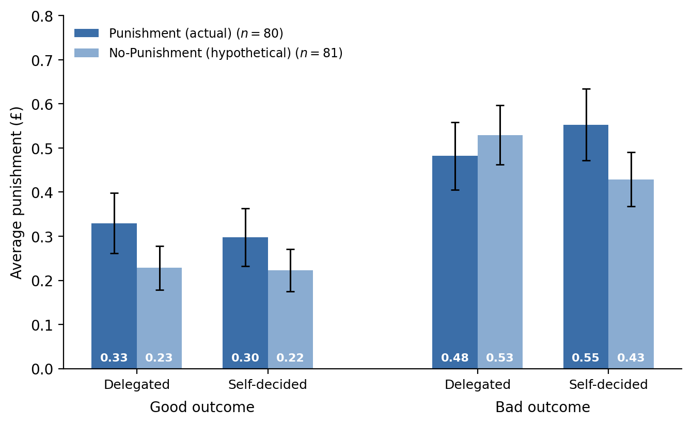

# Cross-condition comparisons: Player A's punishment beliefs and Player B's punishment

Generated 2026-08-11, full samples, house layout (outcome grouping; condition blues, dark = Punishment, light = No-Punishment; ±1 SE whiskers; values at bar base). Not part of the manuscript pipeline. In the No-Punishment condition both objects are hypothetical (beliefs about, and choices of, punishment that could not be imposed).

## Player A: expected punishment by condition

| Scenario | Punishment | No-Punishment | t-test p | MWU p | passers t / MWU p |
|---|---|---|---|---|---|
| Delegated, good | 0.62 | 0.51 | 0.299 | 0.234 | 0.771 / 0.662 |
| Self-decided, good | 0.60 | 0.40 | **0.038** | **0.032** | 0.117 / 0.087 |
| Delegated, bad | 0.92 | 0.89 | 0.768 | 0.785 | 0.885 / 0.808 |
| Self-decided, bad | 0.98 | 0.87 | 0.250 | 0.186 | 0.341 / 0.284 |
| Average over scenarios | 0.78 | 0.67 | 0.109 | 0.129 | 0.349 / 0.385 |

Reading: beliefs are directionally higher under Punishment in every scenario, but only the self-decided/good cell differs significantly in the full sample, and that difference attenuates among passers (weakly significant by MWU only). With five tests per sample, one p = 0.04 is also compatible with multiple-comparison noise. The "closely track" claim in the results footnote is broadly supported; the self-decided/good cell is the one qualification.

## Player B: actual vs hypothetical punishment by condition

| Scenario | Punishment (actual) | No-Punishment (hypothetical) | t-test p | MWU p | passers t / MWU p |
|---|---|---|---|---|---|
| Delegated, good | 0.33 | 0.23 | 0.233 | 0.694 | 0.246 / 0.594 |
| Self-decided, good | 0.30 | 0.22 | 0.356 | 0.597 | 0.177 / 0.253 |
| Delegated, bad | 0.48 | 0.53 | 0.639 | 0.331 | 0.595 / 0.313 |
| Self-decided, bad | 0.55 | 0.43 | 0.225 | 0.686 | 0.236 / 0.550 |
| Average over scenarios | 0.42 | 0.35 | 0.410 | 0.762 | 0.361 / 0.932 |

Reading: no scenario differs significantly between actual and hypothetical punishment, in the full sample or among passers, by either test. Levels are directionally lower hypothetically after good outcomes and for self-decided bad outcomes, and directionally higher for delegated bad outcomes (the reversal discussed in the hypothetical-punishment appendix), but none of these cross-condition contrasts approaches significance. Note the within-condition comparison (delegated vs self-decided, bad outcome) is a different test from these between-condition columns; the weakly significant hypothetical reversal (p = 0.069) is within-subject and lives in the appendix.

## Interpretation notes

1. The two figures together say that neither side of the market changes much when punishment becomes real. Player B's stated punishment schedule is statistically indistinguishable from the schedule he actually implements, and Player A's expectations are broadly similar whether or not punishment is possible. Whatever the treatment does to delegation (Result 1), it does not operate by changing what punishment people expect or intend, but by making the existing schedule enforceable.
2. Caveats for any use in text: elicitation timing differs in payoff-relevance across conditions (two scenarios live in Punishment, none in No-Punishment), and delegation choices preceding the belief elicitation differ across conditions, so cross-condition belief contrasts mix treatment effects with differential post-decision rationalization.
3. If either figure enters the appendix, the natural home is next to the hypothetical-punishment subsection, and the tests should move into the manifest first.
