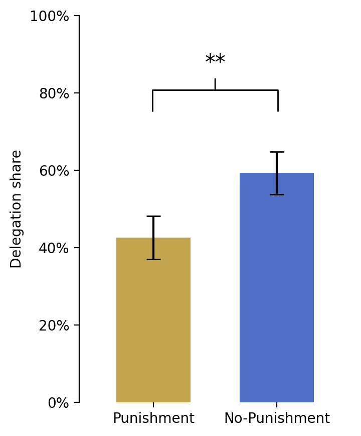
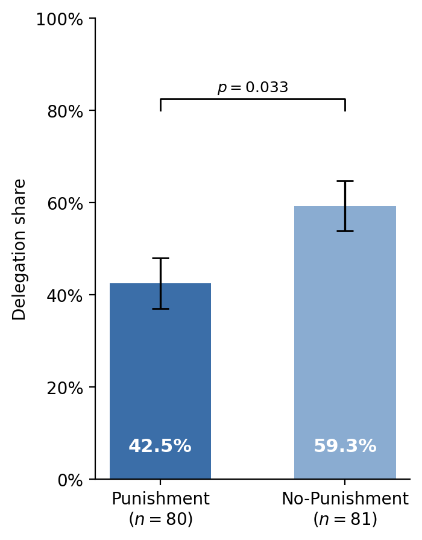
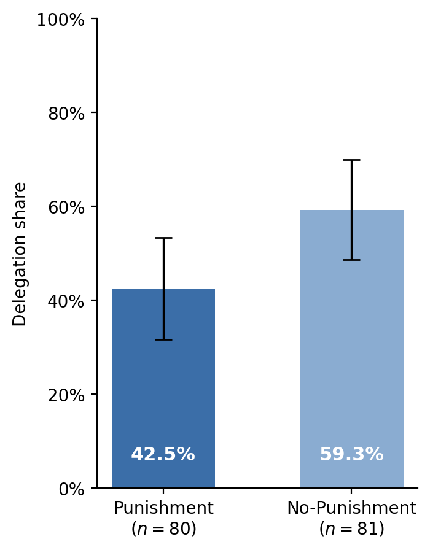
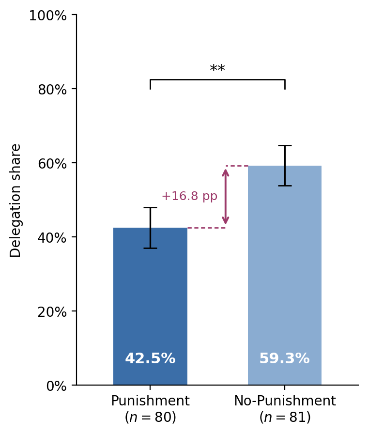
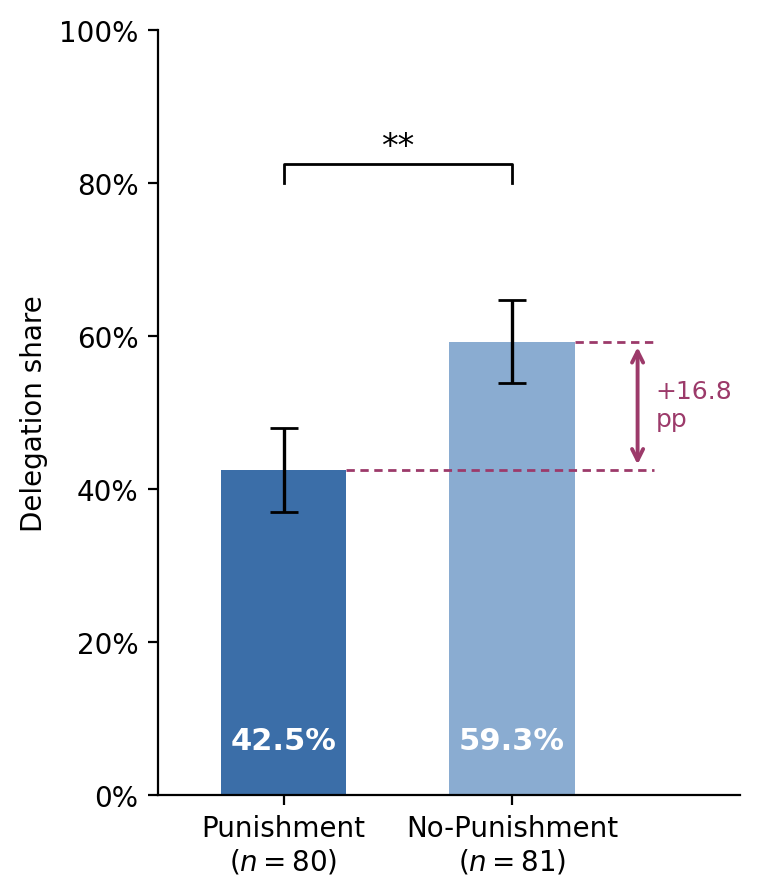
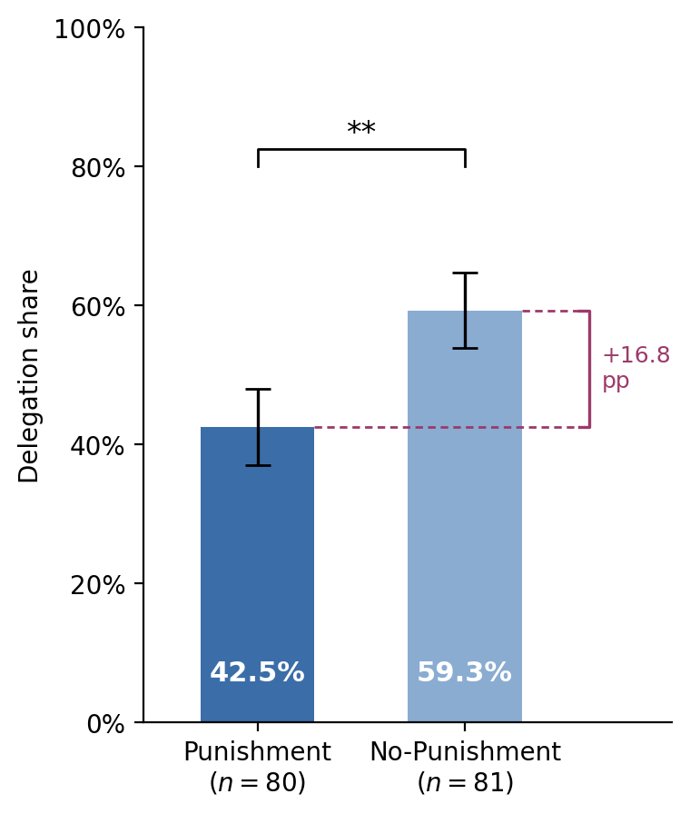
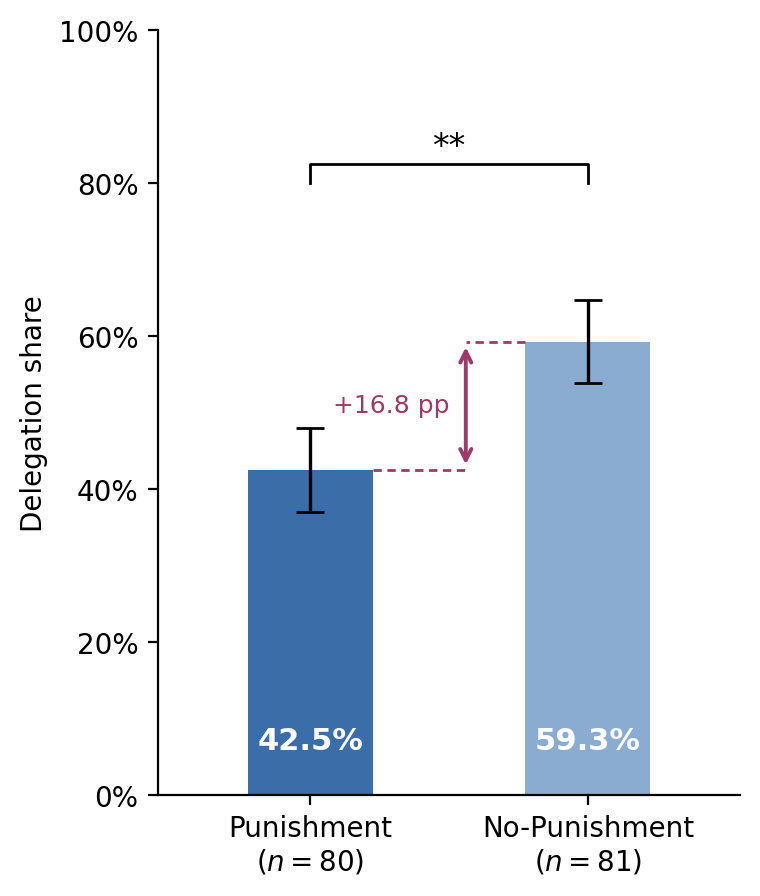
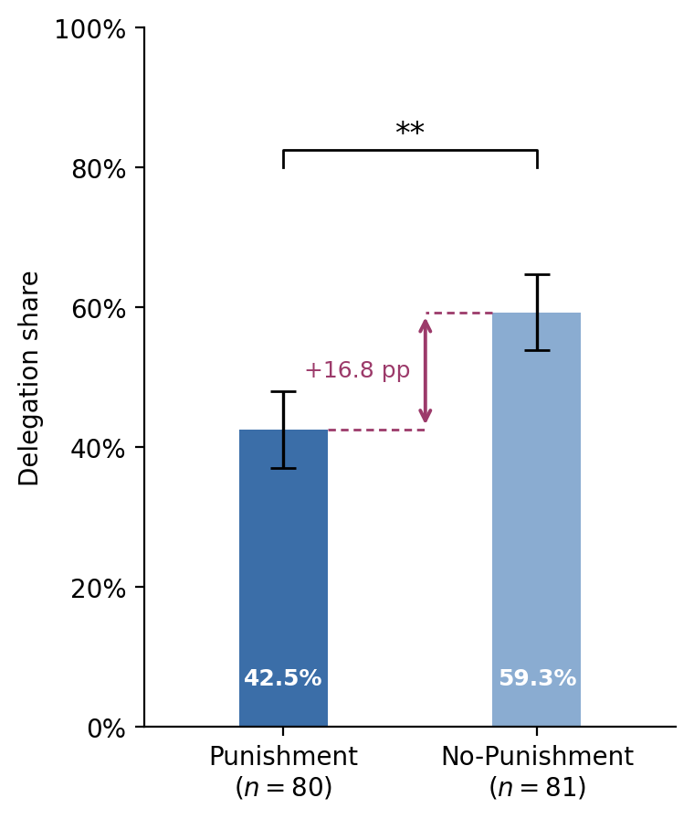
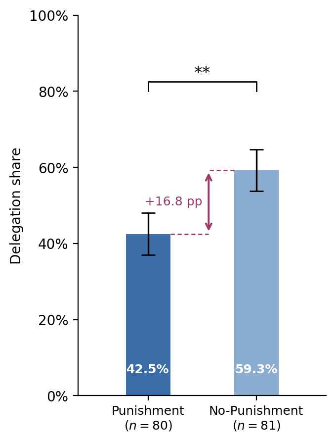

# fig:delegation_shares — style variants for review

Proposed house style for all condition-keyed figures (applied in V1–V3): conditions in the blue pair (dark = Punishment #3b6ea8, light = No-Punishment #8aacd1), matching the performance-overview figure; top/right spines removed; sample sizes in the axis labels; values printed on the bars so the figure is self-contained.

## V0 — current version

Gold/blue coloring, ±SE whiskers, significance bracket with stars.

Issues: the gold/blue pair collides with Figure 3, where gold = share punishing and blue = average punishment (same colors, different meanings across figures); stars conflict with the AEA no-stars convention adopted for the tables; shares and n are not shown, so the figure is not self-contained.

## V1 — blue pair, ±SE whiskers, p-value instead of stars

Minimal restyle. Keeps the current whisker convention (±1 SE) and the bracket, but the bracket now states the test result directly (p = 0.033, Pearson chi-squared per the conventions footnote).

## V2 — blue pair, 95% confidence intervals, p-value bracket

As V1 but whiskers show 95% confidence intervals. More informative than ±SE (readers can see at a glance that the intervals nearly separate) and unambiguous in the note. If adopted, other figures' "error bars are standard errors of the mean" should eventually switch too, for cross-figure consistency.

## V3 — blue pair, 95% confidence intervals, no bracket

Cleanest AER register: the test statistic lives in the text and the figure note, not in the plot. The CI overlap already conveys the message visually.

## Round 2 — per feedback (2026-08-06)

Settled: bracket kept; stars kept, p-value only in the figure note; shares printed in the bars; blue condition pair; ±SE whiskers. New element: the treatment difference (+16.8 pp) shown in an accent color (magenta, matching the accent used elsewhere). Three placements:

### V4 — difference arrow between the bars

Double-headed arrow in the gap between the bars, dashed leaders from each bar top. Most compact; the difference sits where the eye compares the bars.

### V5 — difference arrow right of the bars

Dashed reference lines extend both bar tops to the right margin; the arrow and label sit outside the plot area. Least visual interference with the bars and whiskers; adds figure width.

### V6 — square bracket right of the bars

As V5 with a bracket instead of an arrow, echoing the significance bracket's visual language.

### Round-2 decision

Placement: between bars (V4) vs. right margin with arrow (V5) vs. right margin with bracket (V6). On sign-off, the winner goes into `03_h1_delegation.py`, and the figure note in results.tex gains the p-value ("The difference is significant at the 5% level, Pearson chi-squared, p = 0.033; whiskers denote one standard error of the mean.") plus the stars convention.

## Round 3 — V4 as default, bar width and spacing (2026-08-06)

Reference: V4 above uses width 0.55 at center distance 1.0. Variants:

### V4a — width 0.45, distance 1.0

### V4b — width 0.35, distance 1.0 (value labels reduced to fit)

### V4c — width 0.45, distance 0.85 (narrower figure)

### V4d — width 0.35, distance 0.85 (narrowest; value and tick labels reduced)

Notes: at width 0.35 the in-bar value labels no longer fit at the default size and drop to fontsize 9; at distance 0.85 the tick labels need fontsize 9 to keep clearance. V4a needs neither adjustment.

## Decision points

1. Blue condition pair as the house standard for condition-keyed figures (V1–V3 all assume yes).
2. Whiskers: ±SE (V1) vs. 95% CI (V2/V3) — whichever is chosen should become the paper-wide convention.
3. Bracket: p-value bracket (V1/V2), or no bracket (V3). Stars (V0) conflict with the tables' no-stars policy.
4. Values-on-bars and n-in-labels: keep in all variants (self-containment).

On sign-off, the winner is implemented in `03_h1_delegation.py` (regenerating `figures/delegation_shares.png`) and the figure note in results.tex is updated to match the whisker convention.
