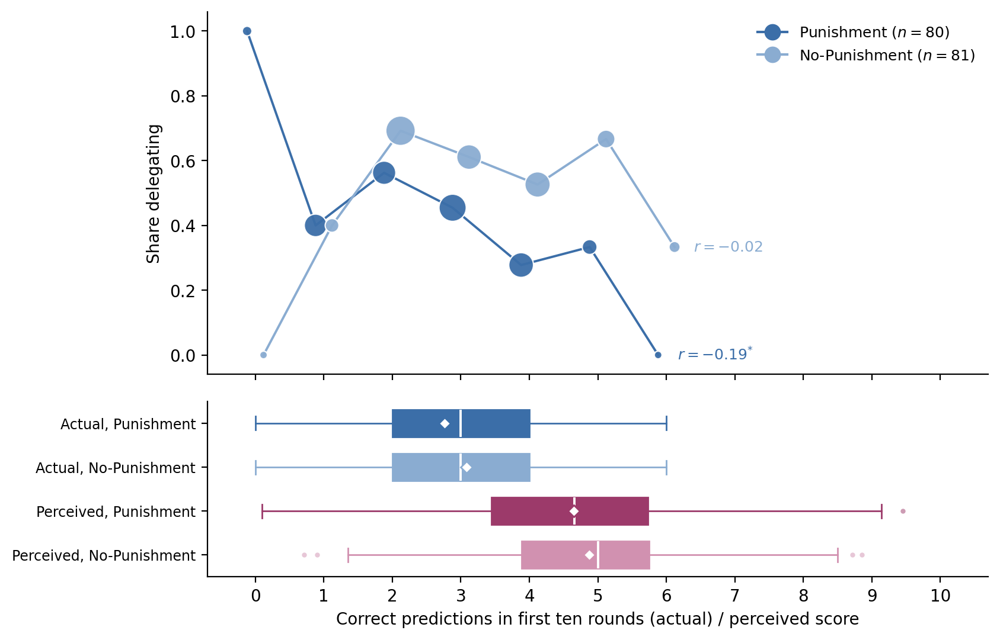
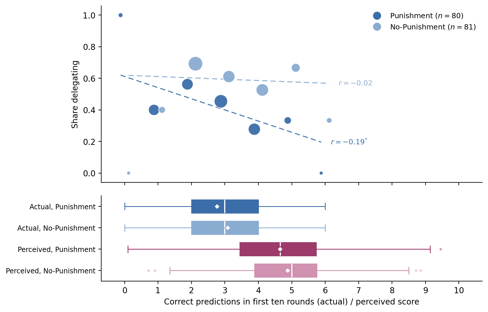
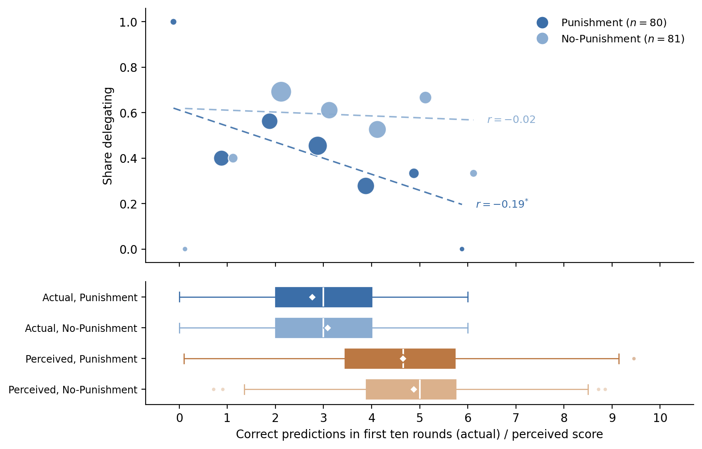
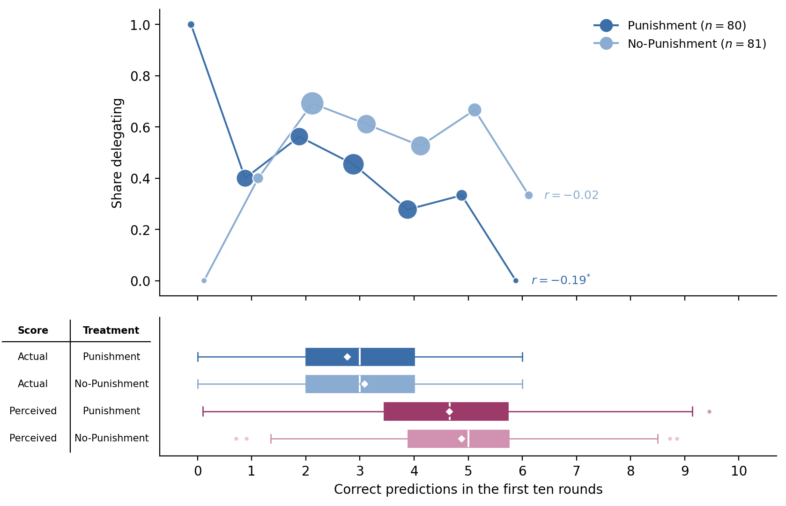

# fig:performance_overview — variants for review (2026-08-10)

All variants include the two requested changes plus one fix carried throughout:

1. Sample sizes in the legend, house style ("Punishment ($n=80$)" / "No-Punishment ($n=81$)").
2. OLS fit lines in the top panel, one per condition (dashed, condition blues; fitted on the individual-level data, delegation on score, not on the binned dots).
3. The x-axis label register fix from the terminology discussion: "expected score (perceived)" becomes "perceived score".

The correlation annotations at the line ends stay as adopted.

## P1 — sample sizes and label fix only (no fit lines)

## P2 — fit lines added, connected dots kept

Four lines in two blues. The dashed fits and the solid connectors compete, especially where they cross; readable but busy.

## P3 — fit lines, connectors dropped

The fit line takes over the connector's role of showing the trend, dots carry the data (size = number of subjects), and the correlation annotations attach to the fit-line ends. This is the cleanest version and my recommendation. One thing the connectors were doing that the fits do not: emphasizing the non-monotonicity at score 0 (the lone always-delegating subject in Punishment). The fit lines summarize through it instead, which is arguably the more honest visual for a linear correlation annotation.

## P4 — P3 with perceived-performance boxplots in terracotta

Palette candidate: magenta was retired to the accent role (difference arrows), and this figure's boxplots are its last appearance as a series color. Terracotta is already the color of Player~A's beliefs (anticipated punishment); perceived performance is also a Player~A belief, so the assignment "terracotta = Player~A's beliefs" would make the palette fully systematic: blue pair = conditions, moss = Player~B punishment, terracotta = Player~A beliefs, gold = shares. Cost: terracotta then encodes two different belief objects (punishment beliefs, performance beliefs), so the color signals "a belief of Player~A" rather than one variable.

## Other edits considered and not made

- Brackets/tests between the boxplot rows (actual vs perceived within condition): the overconfidence comparison is discussed in the selection paragraph without a test claim, so annotation would overpromise.
- Star key in the panel: stays in the figure note per house convention.

## P5 — P1 with bottom-panel labels as a two-column table

Column headers "Score" and "Treatment" (bold), four rows Actual/Perceived x Punishment/No-Punishment, y-ticks removed. Revised per feedback: smaller font (7.5), both columns centered, a horizontal rule below the header row, and a vertical rule between the columns.

## Adopted: P1 (2026-08-10)

Implemented in `07_performance.py`: legend sample sizes in house style, no fit lines, x-axis label simplified to "Correct predictions in the first ten rounds" (the shared unit of all four boxplot rows; the row labels carry the actual/perceived distinction). The magenta-vs-terracotta question for the perceived boxplots (P4) was left open and magenta retained for now.
