# fig:punishment — style variants for review

Design context. Two structural issues in the current figure: (1) a dual y-axis (pounds left, percent right), the one chart form the style literature uniformly advises against; (2) cells grouped by delegation mode, which hides the paper's own finding that punishment loads on the outcome. All variants below regroup the cells by outcome (good pair left, bad pair right), so the figure's shape shows the result: two low bars, two high bars, near-equal within pairs.

Color system: with blue reserved for conditions (delegation-shares, performance figures) and magenta established as realized punishment (realized-vs-anticipated figure), the punishment bars here use the magenta pair — dark = delegated, light = self-decided. The cross-group accent (W3) uses blue in the accent role.

House style carried over: values printed on bars, ±1 SE whiskers, brackets with significance markers (details in the note), no top/right spines.

## W0 — current version

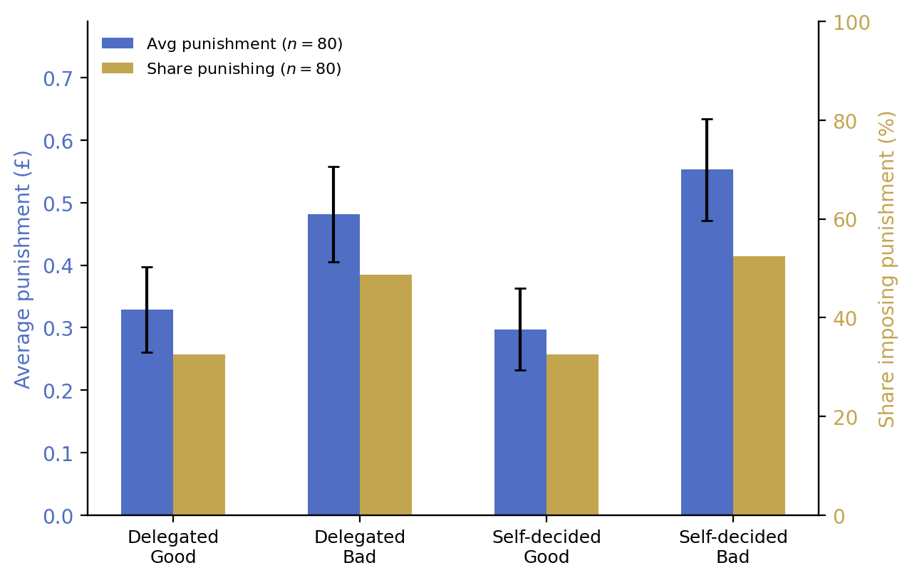

Dual axis, grouped by delegation, gold/blue encoding (blue here clashes with the condition-blue used elsewhere; gold = share).

## W1 — single axis, outcome-grouped, n.s. brackets

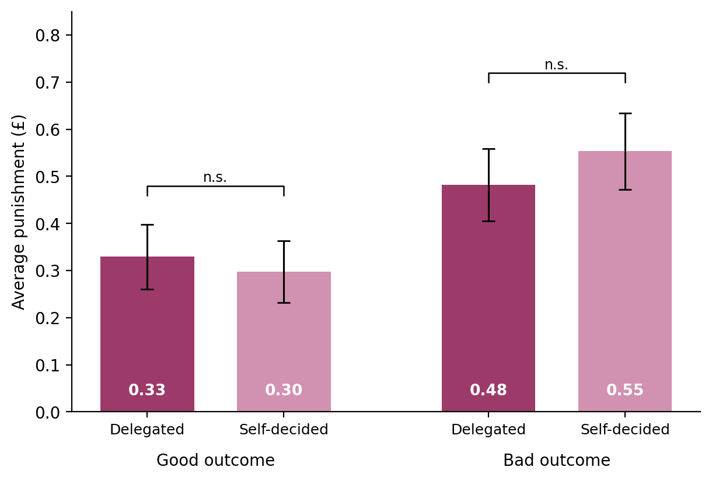

Average punishment only. The share-punishing information moves entirely to the appendix (extensive-margin table and passers figure). Within-outcome pairs carry "n.s." brackets — the H2 message.

## W2 — two stacked panels: amounts and shares

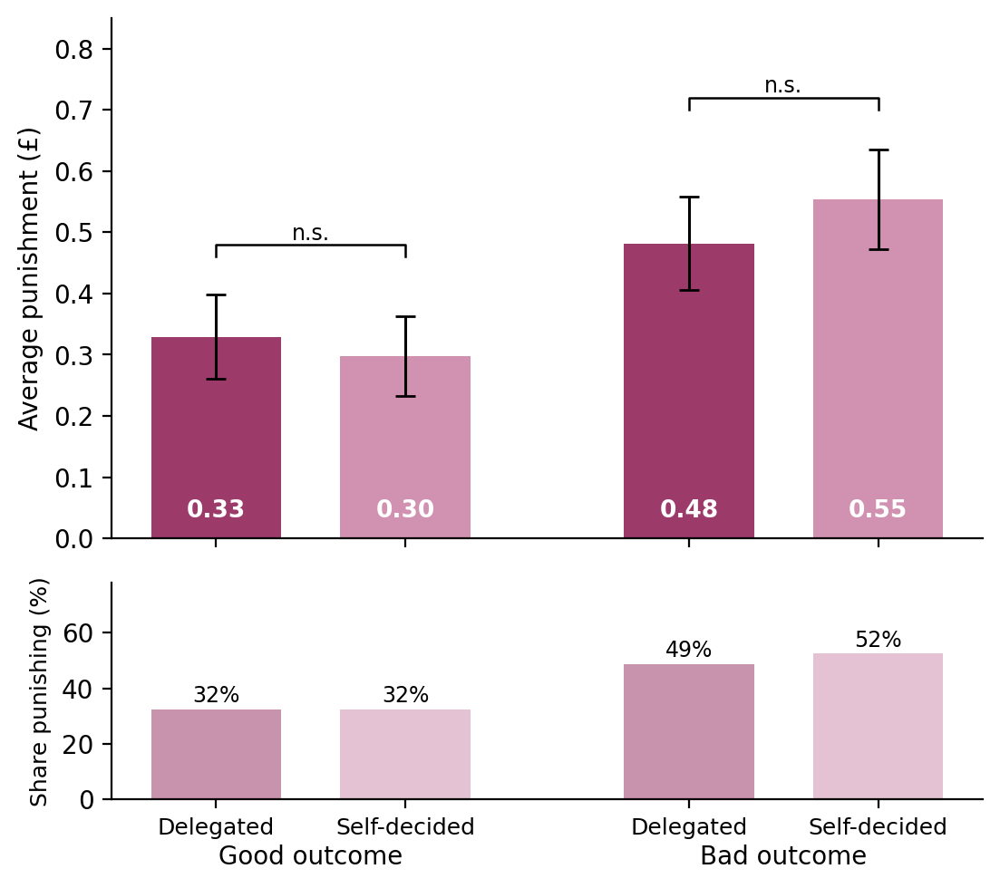

Keeps all information from the current figure without the dual axis: amounts on top (with whiskers and brackets), share punishing below as a slim panel with percentage labels. One axis per panel.

## W3 — W1 plus the outcome effect as accent annotation

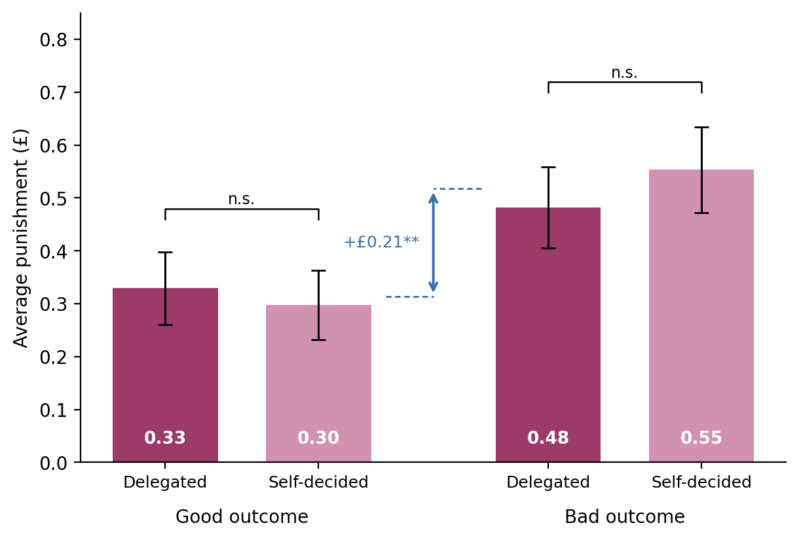

Adds the between-outcome difference (+£0.21, significant at 1%) as a blue accent arrow between the groups, mirroring the delegation-shares figure's difference-arrow language. The figure then shows both text claims at once: outcomes matter (accent arrow), delegation does not (n.s. brackets).

## Round 2 — per feedback (2026-08-06)

Settled: both axes stay; cells reorder to Good (delegated, self-decided) then Bad (delegated, self-decided); gold stays for the share; the blue changes. Two candidates for the average-punishment color:

### W4a — magenta (recommended)

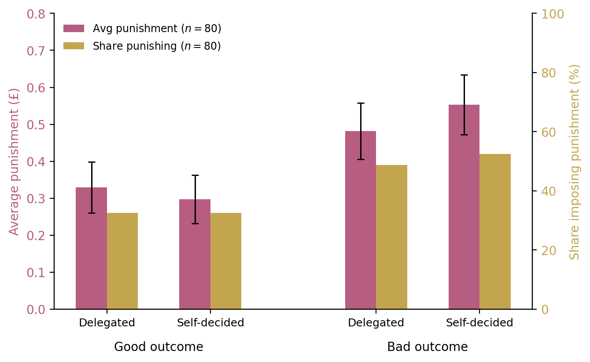

Magenta is already the color of realized punishment in the realized-vs-anticipated figure, so the same quantity wears the same color across figures. Distinct from the condition blues.

### W4b — neutral moss green (alternative)

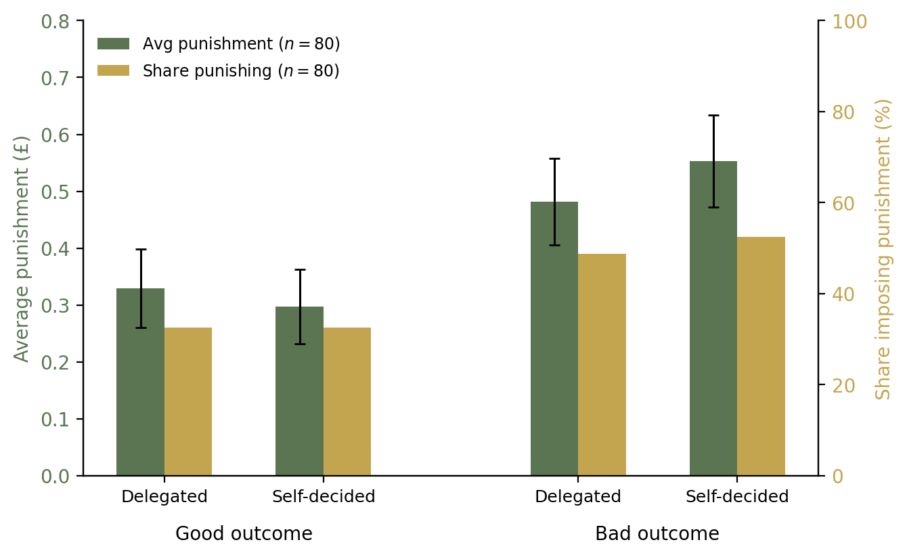

A neutral option if the magenta feels too close to the accent uses elsewhere. Note the belief-figures currently use green for anticipated punishment, so moss green would create its own mild collision; magenta avoids this.

## Round 3 — W5 per feedback (2026-08-06)

Starting from W4b (moss green + gold, both axes, outcome grouping): n.s. brackets added over each outcome pair, with legs at the cell centers (between the green and the gold bar); the good-vs-bad difference in average punishment shown as a magenta arrow between the groups (+£0.21, three stars per the 1% significance level; dashed leader stubs at the group means of average punishment, left axis).

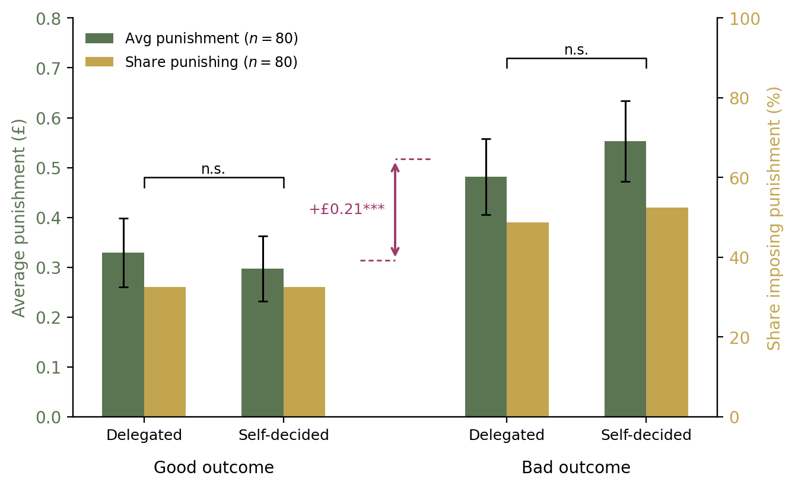

## Round 5 — W5 finalization (2026-08-06)

Per feedback: the difference annotation is green (same as the average-punishment bars, marking it as an amounts quantity), value computed from the data (+£0.20).

### W5g — W5 with green difference arrow

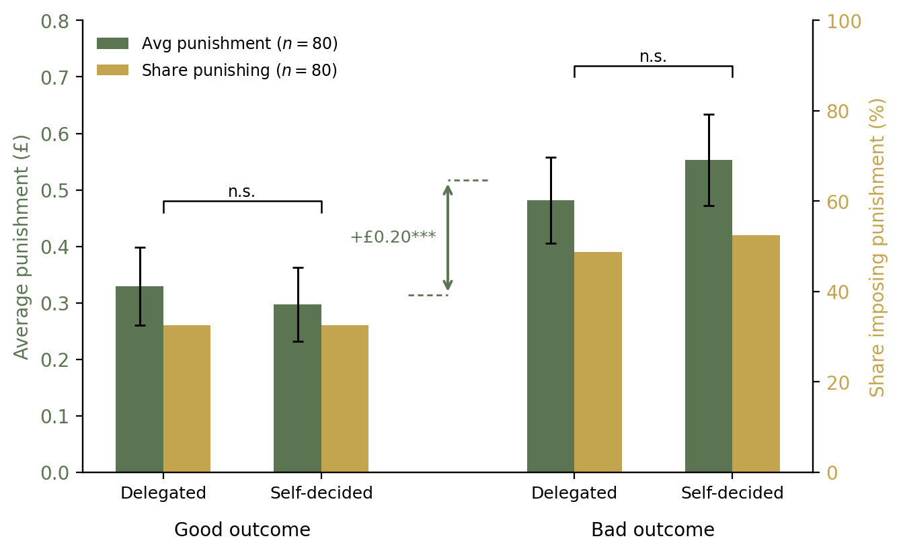

### W8 — calculation made explicit (difference of group means)

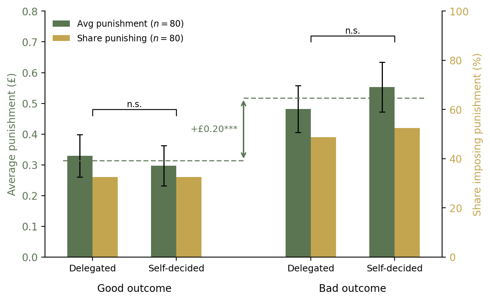

Dashed green lines run from each outcome pair to the arrow at the group mean of average punishment; the arrow connects the two lines, so the reader sees that the +£0.20 is the difference of the two within-outcome means. (Mean labels removed and lines extended to the arrow per feedback.)

### W9 — W8 with values printed on every bar

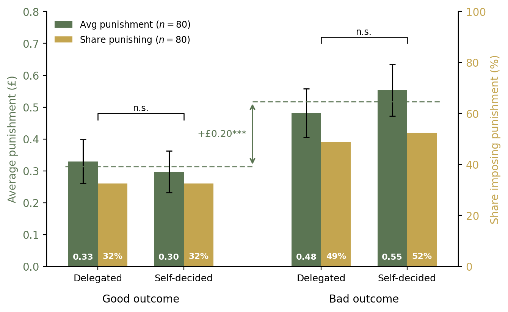

Pounds on the green bars, percent on the gold bars, white bold at the bar base, matching the delegation-shares figure's convention.

## Round 4 — both differences shown (2026-08-06)

Both variants show the good-vs-bad difference in average punishment (green, left-axis units) and in the share punishing (gold, +18.1 pp, paired t p=0.00004). Labels are computed from the data; note the amount difference computes to **+£0.20** (0.204, paired t p=0.0008), while the manuscript text currently says £0.21 — the text number appears stale and needs reconciling.

### W6 — dual axis, both difference arrows in the mid-gap

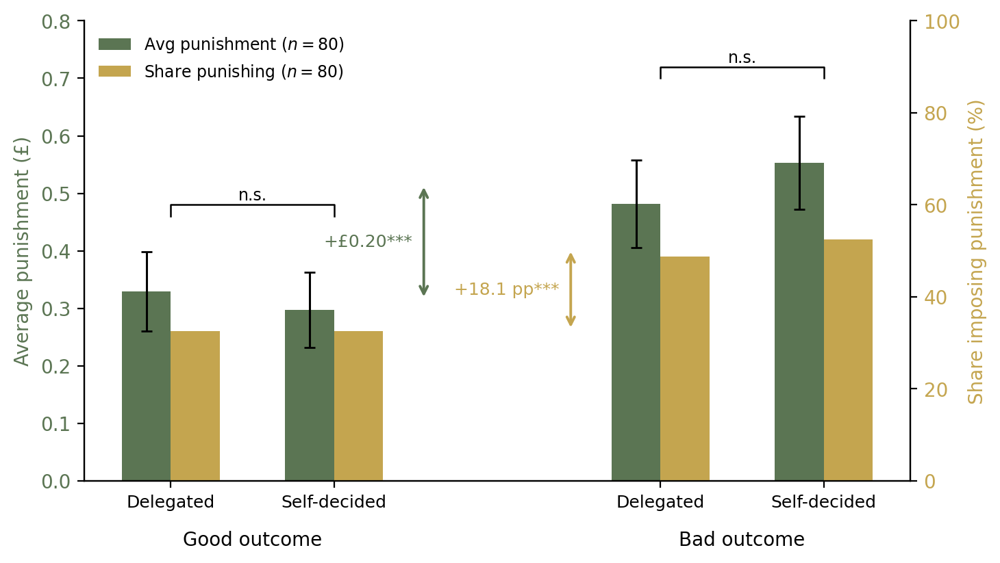

Green arrow on the left-axis scale, gold arrow on the right-axis scale, each labeled in its own color. Wider inter-group gap to fit both.

### W7 — two panels, one difference arrow each

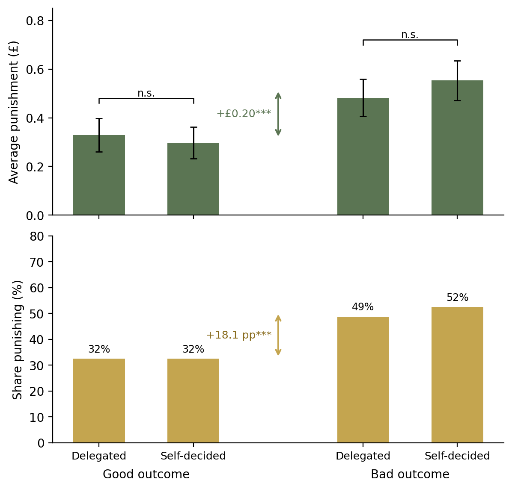

Amounts (green, with whiskers and n.s. brackets) on top; shares (gold, with percentage labels) below; each panel carries its own difference arrow in its own units. No dual axis. Panels equally sized (updated per feedback).

## Decision points

1. Outcome grouping (all variants assume yes — it is the single biggest improvement).
2. Share-punishing information: drop from the main figure (W1/W3) or keep as a second panel (W2). The text discusses the extensive margin in one sentence and the appendix carries the probit table, so W1/W3 lose little.
3. The accent arrow (W3): include or not.
4. Magenta pair for delegated/self-decided as the punishment-figure convention (would carry over to the passers and hypothetical appendix figures for consistency).

On sign-off, the winner is implemented in `20_punishment_figure.py` (main figure; the appendix passers and hypothetical figures restyled to match), and the figure note in results.tex is updated (grouping, colors, bracket key, pointer to the share information's new location if W1/W3).

## Refinement round W10 (2026-08-06)

W10a (mean lines behind the bars), W10b (lines on top at 70% opacity), W10c (lines on top with a white outline); all with SE whiskers on the gold share bars and a tighter outcome-label row. **Adopted: W10a with W10c's label spacing (y = -0.122).** Implemented in production; gold whiskers ($\pm 1$ SE of the binary share, as in the delegation-shares figure) also added to the passers and hypothetical figures, and the figure notes extended accordingly.

## Adopted: W9 (2026-08-06)

Implemented in `20_punishment_figure.py`. Main figure = W9 (annotations: n.s. brackets, dashed group-mean lines, green difference arrow). Passers figure = same design without the annotation layer. Hypothetical figure = outcome grouping and green/gold palette with the full-vs-passers opacity overlay and Player A's anticipated punishment (mint) retained; no in-bar values there (bars too narrow). New manifest keys: `fig_pun_good_outcome_avg` (0.3134), `fig_pun_bad_outcome_avg` (0.5175), `fig_pun_outcome_diff` (0.2041), `fig_pun_outcome_diff_paired_p` (0.00075), `fig_pun_good_pair_paired_p` (0.5347), `fig_pun_bad_pair_paired_p` (0.1308). Figure notes in results.tex and appendix.tex updated; the manuscript's £0.20 wording was already corrected.
