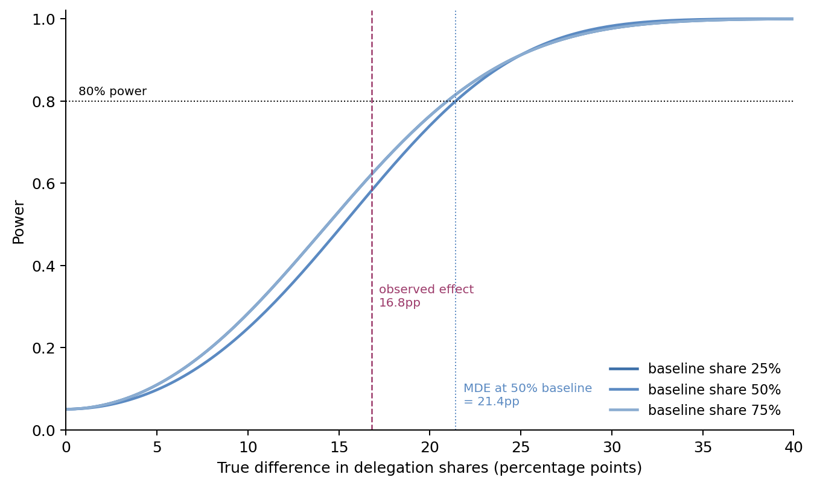
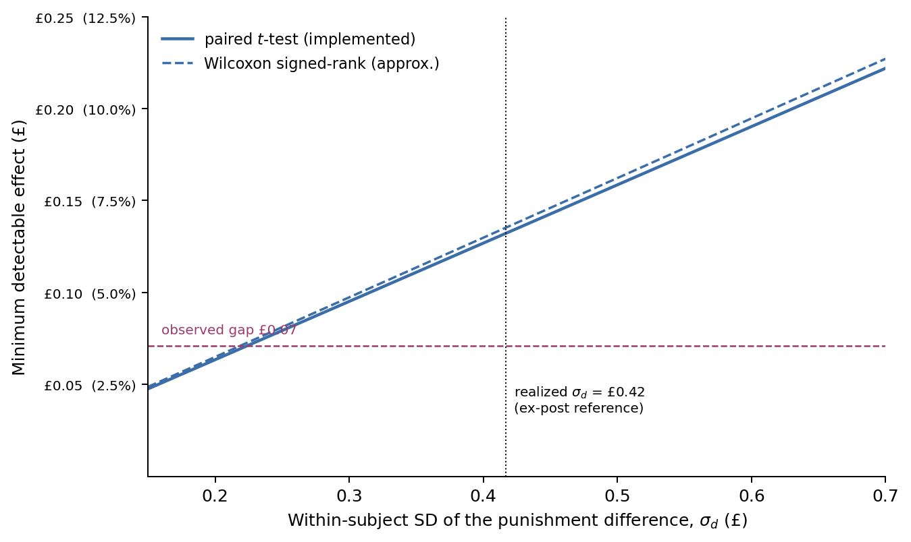

# Ex-ante MDE analysis for the power appendix

**Assumptions:** alpha = 0.05 (two-sided), power = 80%, n = 80 per role per treatment (preregistered allocation; ex-ante, so the extra recruited pair is ignored). No realized data enter the MDE computations; the two "ex-post reference" annotations are marked as such.

## H1 — delegation shares between conditions

Preregistered test: two-sample t-test on delegation shares. Implemented test: Pearson chi-squared (with Fisher's exact as a check). For a binary outcome, the two-sample t-test on shares and the chi-squared test are asymptotically the same test, so **preregistered and implemented tests share the same MDE**. Fisher's exact test is slightly conservative; its MDE is marginally larger.

| Baseline delegation share | MDE (increase) | MDE (decrease) |
|---|---|---|
| 25% | 21.0 pp | — |
| 50% | 21.4 pp | 21.4 pp |
| 75% | — | 21.0 pp |

The MDE is nearly invariant to the baseline share (21.0–21.4 pp across the 25–75% range). Ex-ante power against an effect of the size observed ex post (42.5% vs. 59.3%, 16.8 pp) is **57%**.

## H2 — punishment differential, bad-outcome cell

Implemented test: paired t-test on the within-subject difference (n = 80 Player Bs). MDE = 0.317 × sigma_d, where sigma_d is the within-subject SD of the punishment difference (unknowable ex ante; scenarios below). Percentages express the MDE relative to the £2 punishment range.

| sigma_d (£) | sigma_d (% of range) | MDE, paired t (£) | MDE (% of range) |
|---|---|---|---|
| 0.20 | 10% | 0.063 | 3.2% |
| 0.30 | 15% | 0.095 | 4.8% |
| 0.40 | 20% | 0.127 | 6.3% |
| 0.50 | 25% | 0.159 | 7.9% |
| 0.60 | 30% | 0.190 | 9.5% |

Ex-post reference (not part of the ex-ante analysis): realized sigma_d ≈ £0.42, implying a realized MDE of ≈ £0.13; the observed gap is £0.07.

**Preregistered non-parametric tests (MWU, Kolmogorov–Smirnov):** these are independent-sample tests. Read as a comparison of two independent samples of n = 80, the corresponding two-sample MDE is 0.443 × sigma_level (SD of punishment levels, not differences). The implemented paired design is more powerful whenever the within-subject correlation exceeds 0; the two SD concepts relate via sigma_d = sigma_level × sqrt(2(1 − rho)).

**Wilcoxon signed-rank (implemented non-parametric counterpart):** under a normal shift alternative, its MDE is the paired-t MDE × 1.023 (asymptotic relative efficiency 3/pi). With many zero differences, as in these data, the practical efficiency is lower; the factor is a lower bound.

## Numbers for the appendix text

- H1: MDE ≈ 21 pp at any plausible baseline; power against the observed 16.8 pp effect ≈ 57%.
- H2: MDE between £0.06 and £0.19 (3–10% of the punishment range) for sigma_d between £0.20 and £0.60.

Computed with statsmodels (NormalIndPower, TTestPower); script: scratchpad `power_mde.py` (to be promoted to `scripts/python/16_power.py` on sign-off).
