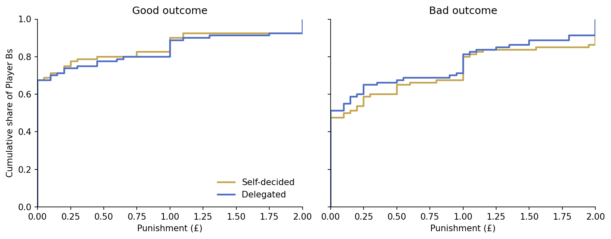
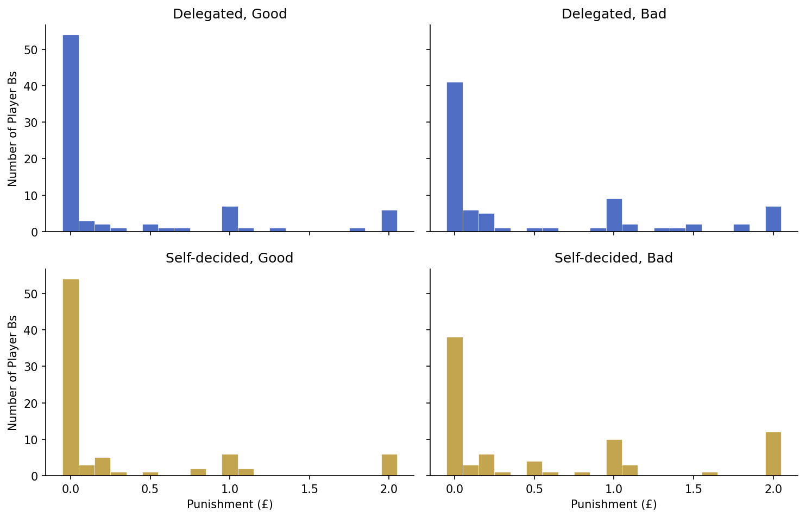
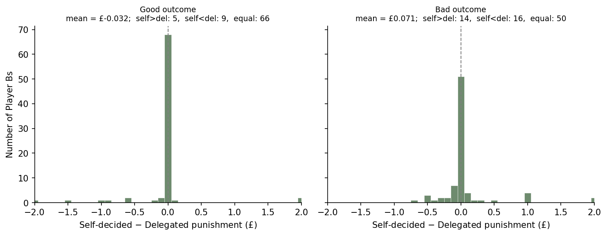
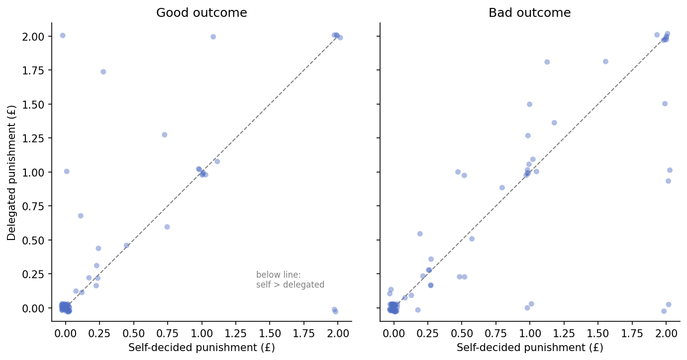

# Punishment distribution across the four scenarios (exploratory)

Full Punishment-condition sample (Player B, `treat == 0`, n = 80). Four ways to show it.

## 1. Per-cell ECDFs (treating cells as independent)
Cumulative distribution of punishment in each cell, by outcome. The height at £0 is the
share who punish nothing; curve separation shows the outcome effect; the near-overlap of
Self vs Delegated within each panel is the null.

## 2. Per-cell histograms
The literal distribution in each of the four cells. The spike at £0 (the non-punishers)
dominates every panel.

## 3. Within-subject difference, self − delegated (measured together)
Per Player B, the gap between self-made and delegated punishment, by outcome. A spike at 0
(subjects who punish identically) with roughly symmetric tails = the paired null.

## 4. Paired scatter, self vs delegated (measured together)
Each Player B is one point (jittered); the dashed line is equality. Points below the line
punish self-made decisions more; symmetry about the line = no insulation. The blob at the
origin is the non-punishers.

