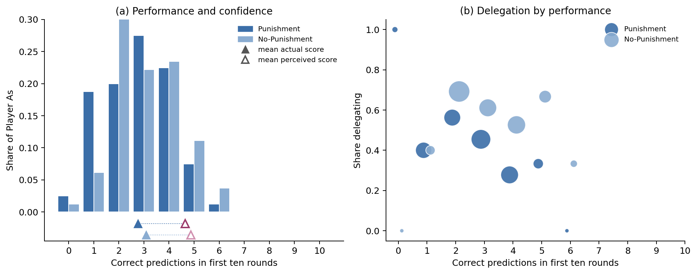
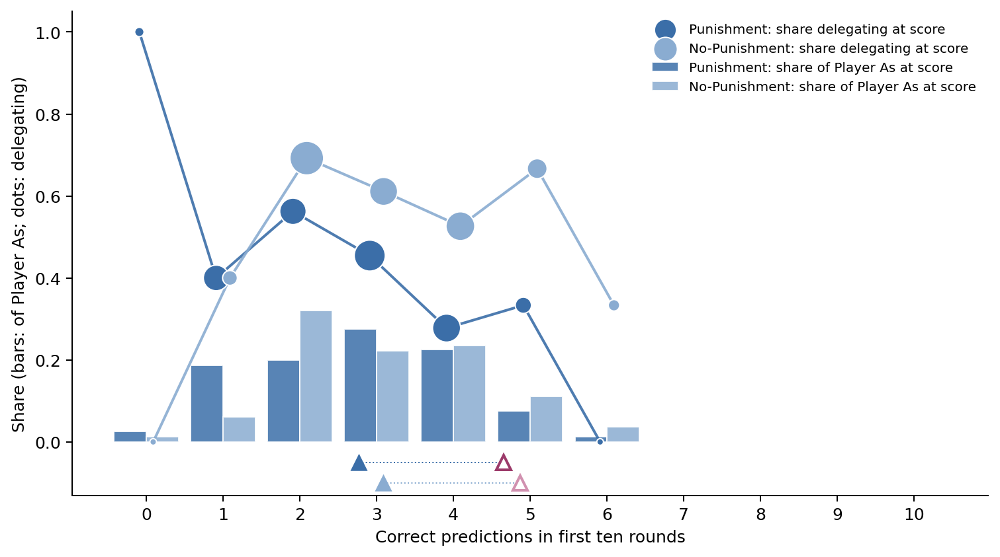

# Supervisor comments — grouped, with implementation thoughts and open questions

Source: `2026-07-27_supervisor_comments_preliminary.md` (line references below refer to that file).
Status codes: ✅ done · 🔶 in progress / partially done · ⬜ open · ❓ needs your decision

---

## Package A — Results-section architecture
*(lines 14, 27, 29, 18 — plus Task 3 from the pre-registration deviations plan)*

> **L14:** "Mehr results aufschrieben (Zu Beginn der Results section: 'Nur Result 1 und 2 sind pre-registered, der Rest is explorative': liest sich gut); also dann auch R3, R4,..."
> **L27:** "Am Anfang der result section: Schreiben welche Art von Test man macht und alles was über 5% als sig bezeichnet. Also die generelle Regel beschreiben."
> **L29:** "Da schreiben: 'ich gucke mir die beiden pre-registered hypothesen an und dann exploratory um zu verstehen was passiert ist'"
> **L18:** "Passers (Entscheiden: Ja oder nein; und das andere in den Appendix)"

These four comments all land in the same two places: a new conventions paragraph at the top of the results section, and the subsection structure below it. Do them as one pass.

**A1 (line 27) — State the testing conventions up front.** ⬜
A short paragraph after the sample description: which tests are used by default (two-sided throughout), what "significant" means (5% level; describe the general rule once instead of per-test), and robust/HC1 SEs for regressions.
- *My read:* uncontroversial, pure win. It also retires per-instance clutter like naming both chi-squared and Fisher every time.
- **Q-A1:** Two-sided at 5% as the stated rule, with 10% called "weakly significant"? (The manuscript currently uses "borderline significant" and "weakly significant" informally — the conventions paragraph should pick one term.)

FB: Let's put this into a footnote instead of the main text. Please draft this footnote. We can use "weakly significant". Please point me to the lines in the manuscript, which need to be changed.

**Claude:** Footnote draft (to attach at the end of the A2 framing sentence, per your placement decision):

> `\footnote{Unless stated otherwise, all tests are two-sided. We describe results as significant if $p<0.05$ and as weakly significant if $0.05 \leq p < 0.10$. Delegation shares are compared using Pearson chi-squared tests, with Fisher's exact tests yielding the same conclusions throughout. Within-subject punishment comparisons use paired $t$-tests, with Wilcoxon signed-rank tests as non-parametric counterparts. Regressions report robust (HC1) standard errors.}`

Manuscript lines to change once the footnote exists (all in results.tex — **updated 2026-07-28 after the framing paragraph landed at line 5; everything shifted +2**):
- **Line 22** (Figure delegation-shares note): "The two-sided difference is significant at the $5\%$ level under both..." — drop "two-sided" (now stated once in the footnote).
- **Line 26**: "loads negatively and approaches significance under the attention restriction ($p=0.068$)" → "loads negatively and is weakly significant under the attention restriction ($p=0.068$)".
- **Line 45**: "is $-0.103$ and borderline significant ($p=0.08$)" → "...and weakly significant ($p=0.08$)".
- **Line 118**: two instances of "two-sided $t$-test" → "$t$-test".
- **Line 131**: "performance loads negatively and approaches significance" → "...and is weakly significant"; also "two-sided $p=0.039$" → "$p=0.039$".
- **Line 161**: "two-sided $p=0.66$" → "$p=0.66$".
- **Line 9**: I recommend *keeping* the explicit test naming here (first use, headline result). However, since the pasted footnote retains the Fisher clause ("...yielding the same conclusions throughout"), the duplicate Fisher p-value can now go: drop "; Fisher's exact, $p=0.041$" at line 9, and in the line-22 figure note drop "and a Fisher's exact test ($p=0.041$)". The separate open `\hl` comment on one- vs. two-sided hypotheses at line 9 is untouched by this package; it remains your pending framing decision.
- Line 32 ("significant at the $1\%$ level") already conforms; no change.

FB: I will copy paste your footnote and make the line edits.

**A2 (line 29) — The framing sentence.** ⬜
"We first examine the two preregistered research questions (Results 1 and 2); the remaining analyses are exploratory and serve to understand the mechanism." Her own wording ("liest sich gut") suggests she wants it almost verbatim.
- *My read:* belongs in the same conventions paragraph as A1. Careful wording: preregistered **research questions**, not hypotheses (consistent with our directionality decision).
- **Q-A2:** OK to say "preregistered research questions" rather than "hypotheses"? (Matches the AsPredicted text now in the appendix.)

FB: The "liest sich gut" referred more generally that she wants such a sentence. We do not have to use this exact wording. Let's maybe call them the two hypotheses w.r.t. to the pre-registered research questions, or is that too convoluted? You are calling them Results 1 and 2, even though they have not been introduced yet. Does that make sense? Also, isn't the analysis w.r.t. what determines the delegation decsion or some other analysis also pre-registered? How do we deal with that? Regarding placement: I agree with you. The footnote of A1 could be added after the sentence for A2.

**Claude:** Three answers, then the draft.
1. *"Two hypotheses w.r.t. the preregistered research questions" — too convoluted?* Slightly, in that word order — but the idea is exactly right and rescues the directionality issue. Cleaner variant: "the two hypotheses derived from our preregistered research questions."
2. *Forward-referencing Results 1 and 2* — you're right, that was sloppy of me; they don't exist yet at that point. Referencing the **hypotheses** (introduced in Section 4) instead is correct and reads naturally.
3. *Good catch on the secondary analyses.* The pre-registration is not silent on the rest: Question 5 pre-specifies the Probit regressions of delegation on treatment, beliefs, and socio-demographics (= Table `del_decision_determinants`), and Question 8 pre-registers as secondary analyses the role of performance and performance beliefs, and the consistency between punishment beliefs and delegation (= the belief-specs analysis). So a flat "the rest is exploratory" would be *understating* how much was preregistered. I suggest one honest clause acknowledging this — it costs five words and strengthens the paper.

Draft (inserted as a short paragraph after the sample/balance paragraph at results.tex:3, before the first subsection; the A1 footnote attaches at the end of the second sentence):

> "We first test the two hypotheses derived from our preregistered research questions. The subsequent analyses serve to understand the mechanism behind these results; they are exploratory in nature, although several of them, including the determinants of the delegation decision and the consistency between punishment beliefs and delegation, were outlined as secondary analyses in the pre-registration.\footnote{[A1 conventions footnote]}"

(If that middle sentence feels heavy, the minimal version is: "The subsequent analyses are exploratory, several of them outlined as secondary analyses in the pre-registration." — the specifics are visible in the appendix anyway.)

FB: How about this wording: "In the following, we first test the two main hypotheses derived from our preregistered research questions. The subsequent analyses serve to understand the mechanism behind these results and are exploratory in nature with several of them outlined as secondary analyses in the pre-registration.\footnote{[A1 conventions footnote]}" Any suggestions for improvement?

**Claude:** Your version works; two refinements to consider.
1. The second sentence runs three clauses deep, and the "with several of them outlined..." attachment carries the most important nuance in the weakest grammatical position. It also makes the preregistered-secondary point sound additive, when it is really a concession to the word "exploratory." Splitting and using "though" fixes both:

> "In the following, we first test the two main hypotheses derived from our preregistered research questions. The subsequent analyses serve to understand the mechanism behind these results. They are exploratory in nature, though several of them were outlined as secondary analyses in the pre-registration.\footnote{[A1 conventions footnote]}"

2. Optional, pure taste: "In the following, we first..." doubles the sequencing signal; the paragraph sits at the top of the results section, so "We first test..." alone carries it. Keep "In the following" if you like the transitional cue.

With the split, the A1 footnote can attach either after "these results." (my slight preference, since the conventions govern the tests just announced) or at the very end as in your version. Both fine.

**A3 (line 14) — Numbered results R3, R4, ...** ⬜
Candidates, in the order the Mechanisms section currently develops them:
- **R3 — Selection pattern:** when punishment is possible, better-performing Player As keep the decision (currently prose at the end of the performance-and-delegation discussion).
- **R4 — Belief evidence:** on average no expected punishment penalty for delegation; belief heterogeneity nonetheless predicts delegation among passers.
- **R5 (optional) — Effort:** performance improvement concentrates where punishment is impossible.
- *My read:* R3 and R4 are clearly result-worthy. R5 is a non-finding used as an elimination step; numbering it elevates it — but her "Effort channel ist gut!" suggests she values it, and numbering non-findings is legitimate when they carry the mechanism argument.
- **Q-A3a:** Number all three, or only R3/R4?
- **Q-A3b:** Should the numbered results live inside the Mechanisms subsection where the evidence appears (my recommendation — keeps the elimination logic readable), or should the section be restructured so each result gets its own subsection?

FB: Is that truly the current order? Please check the current draft version. Perhaps switch the order of R4 and R3. For now, we can include R5. Please draft each result and suggest the line number in which to include each of them. They should all be in the mechanism subsection, not separate subsections.

**Claude:** You're right and I was wrong — I checked the current draft: the Mechanisms section runs beliefs (lines 71–114) → selection/performance (116–129) → effort (157–159). So the numbering follows your switch: **R3 = beliefs, R4 = performance, R5 = effort.** Drafts below, each formatted like Results 1–2 (`\medskip \noindent\textbf{Result~N.} \textit{...} \medskip`), with insertion points in the current results.tex:

*(Line references below updated 2026-07-28: +2 shift after the framing paragraph landed at results.tex line 5.)*

**Result 3** — insert after line 116 (the "Taken together, the belief evidence is mixed..." paragraph that closes the belief analysis):
> *On average, Player~A expects no punishment penalty for delegation, mirroring Player~B's actual punishment behavior. Within the \textit{Punishment} condition, however, Player~As who expect a larger penalty for deciding themselves are more likely to delegate.*

**Result 4** — insert after line 131 (the "Performance and delegation" paragraph, before the figure environments):
> *In the \textit{Punishment} condition, better-performing Player~As are less likely to delegate. The additional delegation in the \textit{No-Punishment} condition comes disproportionately from better performers.*

**Result 5** — insert after line 161 (the paragraph ending "...the opposite of what a punishment-motivated effort story would predict."):
> *The prospect of punishment does not induce additional effort. Non-delegators improve on their prior performance only where punishment is impossible.*

Two notes: (i) Result 4's second sentence deliberately restates the composition finding rather than the correlation, so the two sentences carry the within-condition and the between-condition version of the same fact; (ii) once these exist, the A2 framing sentence and the "Taking stock" paragraph (line 163) can refer to "Results 3–5", which tightens that paragraph — I'd propose that wording at implementation.

FB: Thanks, I will take it from here.

**A4 (line 18) — Passers rule (= deviations Task 3).** ❓
Main text = full sample; passer analyses = appendix. Inventory of affected spots is in `quality_reports/plans/2026-07-27_prereg-deviation-followups.md` (Task 3).
- *The one hard decision:* the belief-analysis headline (R4 candidate) is significant **only among passers** (full-sample AME 1.3–1.4pp, n.s.; passers 4.7pp, p=0.011). A strict rule moves your sharpest belief evidence to the appendix.
- **Q-A4a:** Strict rule (full sample in text, passers in appendix, belief story weakened in main text) — or a stated exception for the belief analysis, on the argument that the attention check sits on the belief-elicitation screen itself and is an ex-ante quality screen for exactly that data?
- **Q-A4b:** The punishment figure currently overlays passers at lower opacity. Under the rule, drop the overlay or keep it as a visual robustness cue?

FB: Let's proceed in steps and not change anything about the passers/non-passers right now. 

**Claude:** Understood — A4 stays parked. Nothing in A1–A3 touches the passers structure. The second `\hl` in the appendix deviations paragraph (the full-sample/passers rule sentence) stays flagged until this is picked up again, and deviations Task 3 remains open in the plan file.

---

## Package B — The mechanism story and its threats
*(lines 9, 16, 33–34 — plus the deferred beliefs-caveat discussion)*

> **L9:** "Effort channel ist gut!"
> **L16:** "Performance relationship: könnte an einem misunderstanding liegen...Leute checken nicht dass der gleichgut ist"
> **L33–34:** "bottom line: faul+feige wahrnehmung --> daher keine delegation / Das is quasi eine Art von algorithm aversion, die anders ist als die bisherigen (preference for 'made by hand') -> humans in the loop"

**B1 (line 9) — Signaling/perception as the highlighted explanation.** 🔶
Intro already ends the mechanism paragraph on signaling; the results-section signaling paragraph is yours to write. Deferred per your instruction; the "beliefs are not so reliable" argument will be needed there.
- **Q-B1:** When you draft it, do you want me to prepare the belief-caveat sentences (unincentivized, post-decision, two cells hypothetical) as support material, or will you write it solo?

FB: We don't need to write it again. Already in the results section do we include such a paragraph/qualification of the belief measure. We do, however, have to write something on the signaling value of non-delegation. In terms of placement I am thinking about after the result that seemingly not more effort is put for non-delegators than before, compared to the treatment in which punishment is not possible. Please draft a paragraph. Perhaps a better placement is actually earlier where we introduce shirking as a motive?

**Claude:** I recommend your first instinct — **after Result 5**, replacing the `\hl` exploration comment at results.tex:178, just before "Taking stock." Reasons against the earlier placement (at the shirking mention, line 73): the signaling story's two supporting facts are Result 3 (no expected punishment penalty, so it must not run through anticipated punishment) and Result 5 (no actual extra effort, so the signal must lie in the choice itself) — placed at line 73 it would arrive before either exists and would get swept away by the belief refutation that immediately follows. What the earlier spot needs is only a forward pointer; suggested addition at the end of the line-73 paragraph: "A related motive that does not operate through expected punishment is discussed at the end of this section."

Paragraph draft (goes after Result 5):

> `\paragraph{The signaling value of not delegating.}` A final explanation runs through what the delegation choice itself communicates. By keeping the decision, Player~A conveys to Player~B that she takes the task seriously and intends to try hard on his behalf. Delegating, in contrast, may be perceived as shirking a decision that matters for another person. This motive is related to the shirking channel discussed above, but it does not operate through expected monetary punishment. It suffices that Player~A cares about how the person holding sanctioning power perceives her choice. The motive is therefore compatible with Result~3, as an image concern of this kind need not be reflected in stated punishment expectations, particularly if those are measured with noise. It is also compatible with Result~5. The signal lies in the choice itself, so sending it requires no additional effort afterwards. Finally, unlike preferences over process or uncertainty, the motive is inherently treatment-dependent. The delegation choice is worth managing only when the affected party holds sanctioning power. In our environment, in which no self-serving option exists and outcomes are noisy, the delegation decision is moreover the only deliberate act Player~B observes, which may lend the signal particular weight.

Notes: the last sentence deliberately ties the story back to the Departures paragraph (this also closes C2 below). If this paragraph lands, the "Taking stock" paragraph needs one added sentence so the section no longer ends with all candidates eliminated — e.g. "What remains is the signaling account, which is consistent with Results~3--5 but which our design cannot test directly." Happy to fold that in on your sign-off.

FB: I really dont see how Result 3 supports the signaling story. There would be no point in signaling if no differential punishment is expected. Please explain that to me or reconsider and re-draft the paragraph and the paragraph placement.

**Claude:** You're right, and my draft overclaimed. Result~3 does not *support* the signaling story — at best it fails to kill it, and only under one of two auxiliary assumptions. Let me lay the logic out. If the signal's only payoff were milder expected punishment, then a flat expected-punishment differential (R3's average) leaves nothing to gain from signaling, exactly as you say. The story survives only via one of two routes. **Route 1 (judgment as the payoff):** Player~A cares about Player~B's *opinion* of her (being thought lazy or cowardly), not only about the fine. The punishment-belief elicitation measures expected fines, not expected judgment, so a flat fine differential doesn't contradict an image motive. The treatment-dependence then runs through sanctioning power making B's judgment *consequential* rather than a mere opinion. **Route 2 (measurement):** decision-time expectations differed from what our post-decision, unincentivized elicitation captured — the "beliefs are not so reliable" argument you anticipated earlier. Honest drafting has to present the story as *requiring* one of these assumptions, not as being corroborated by R3. Re-draft below does exactly that; placement stays after Result~5, because the paragraph now needs both R5 (which it survives cleanly) and R3 (which it must confront) on the table — at the earlier shirking spot neither exists yet.

> `\paragraph{The signaling value of not delegating.}` A final explanation runs through what the delegation choice itself communicates. By keeping the decision, Player~A conveys to Player~B that she takes the task seriously and intends to try hard on his behalf. Delegating, in contrast, risks being perceived as shirking a decision that matters for another person. Result~5 does not speak against this story. The signal lies in the choice itself, so sending it requires no actual additional effort. Result~3 constrains it more sharply. If the signal's only payoff were milder expected punishment, an average expectation of equal punishment for delegated and self-made decisions would leave nothing to gain from sending it. The motive therefore requires that Player~A cares about Player~B's judgment itself, beyond the monetary punishment attached to it, or that decision-time expectations are captured imperfectly by our post-decision, unincentivized belief measure. Neither assumption is directly testable in our design. The motive nevertheless remains a candidate because it is inherently treatment-dependent. Player~B observes the delegation choice in both conditions, but only the possibility of punishment turns his judgment into a consequence rather than a mere opinion. A concern for how the choice is perceived therefore predicts less delegation precisely where punishment is possible. In our environment, where no self-serving option exists and outcomes are noisy, the delegation choice is moreover the only deliberate act Player~B observes, which may lend this perception particular weight.

Knock-on to check on your side: the intro's signaling passage currently says the story "is consistent with the absence of measurable extra effort" (fine) but does not confront the R3 tension. That's acceptable for the intro's altitude, but if you want strict alignment, its "the signal is worth sending only when Player~B holds sanctioning power" sentence could become "...only when Player~B holds sanctioning power, so that his judgment carries consequences" — a five-word patch that imports Route 1's logic.

FB: I find this line of reasoning a bit too complicated. Lets keep it simpler. Also, when we discuss shirking earlier on, this is pretty much very interconnected with the signaling story. Perhaps it makes sense not to discuss shirking this early (we still have the morality of the decision there) and only introduce it only in the end? Here is further feedback on your draft:

"\paragraph{The signaling value of not delegating.} A final explanation runs through what the delegation choice itself communicates. [FB: The introductory sentence should connect better to the end of the previous paragraph, where it will be inserted.] By keeping the decision, Player~A conveys to Player~B that she takes the task seriously and intends to try hard on his behalf. Delegating, in contrast, risks being perceived as shirking a decision that matters for another person. [FB: DonÄt speak with such certainty...it is very speculative...so "may want to convey..." or "...could risk..."] Result~5 does not speak against this story. The signal lies in the choice itself, so sending it requires no actual additional effort. Result~3 constrains it more sharply. If the signal's only payoff were milder expected punishment, an average expectation of equal punishment for delegated and self-made decisions would leave nothing to gain from sending it. The motive therefore requires that Player~A cares about Player~B's judgment itself, beyond the monetary punishment attached to it, or that decision-time expectations are captured imperfectly by our post-decision, unincentivized belief measure. [FB: I would not say that it "requires it", but maybe it "can be reconciled by..."] Neither assumption is directly testable in our design. [FB: No need to say this.] The motive nevertheless remains a candidate because it is inherently treatment-dependent. Player~B observes the delegation choice in both conditions, but only the possibility of punishment turns his judgment into a consequence rather than a mere opinion. [FB: So this I find a stretch. I would rather just say that this could be the case...we dont see it in beliefs, but the belief measure has strong limitations/weaknesses. Lets not argue that with the punishment possibility this thing activates, yet not through the amount of punishment, or maybe say this but only in a footnote. Do we want to speak to how the belief elicitation is also treatment-dependent?] A concern for how the choice is perceived therefore predicts less delegation precisely where punishment is possible. In our environment, where no self-serving option exists and outcomes are noisy, the delegation choice is moreover the only deliberate act Player~B observes, which may lend this perception particular weight."

**Claude:** On the structural question first: yes, moving shirking out of the early paragraph is the better design, and I'd do it. Concretely, in the anticipated-punishment paragraph (results.tex:73): delete the two shirking sentences ("Alternatively, the same anticipated punishment pattern could arise from a simple shirking motive..." plus its footnote), and change "Both motives carry the same testable implication..." to "This motive carries the testable implication...". The paragraph then tests only the morality-based expectation story against the beliefs, and shirking appears exactly once, at the end, where it belongs. Bonus: the deleted footnote's observation (shirking-sanctioning could rationalize the positive punishment observed after good delegated outcomes) moves into the new paragraph's footnote, where it now works as a small piece of circumstantial support. The forward-pointer sentence I suggested earlier becomes unnecessary and is withdrawn.

On your footnote question (belief elicitation being treatment-dependent): I'd leave it out. The belief analysis is already restricted to the *Punishment* condition, and the hypotheticality differences across conditions are covered in the caveats paragraph at results.tex:75 — importing that here adds a third qualification to a paragraph you want simpler.

Simplified re-draft with all your line edits (hedged verbs, "can be reconciled," testability sentence cut, activation logic demoted to a footnote):

> `\paragraph{The signaling value of not delegating.}` Although non-delegators do not appear to exert additional effort, the delegation choice itself may communicate effort. By keeping the decision, Player~A may want to convey to Player~B that she takes the task seriously and intends to try hard on his behalf. Delegating, in contrast, could be perceived as shirking a decision that matters for another person. The signal lies in the choice itself and requires no actual additional effort, so Result~5 does not speak against this story. Result~3 seems to. If Player~A expects no punishment penalty for delegation, there is little to gain from the signal. The two can be reconciled if Player~A cares about Player~B's judgment itself, beyond the punishment attached to it,\footnote{Sanctioning power may make Player~B's judgment consequential in Player~A's eyes. A concern for how the delegation choice is perceived would then bind only when punishment is possible, even though the expected amount of punishment does not differ by delegation choice. Relatedly, such a concern on Player~B's side could rationalize the positive punishment observed after good outcomes under delegation.} or if our belief measure, unincentivized and elicited only after the delegation decision, captures the beliefs behind that decision imperfectly. A concern about being perceived as shirking would then reduce delegation where punishment is possible. In our environment, where no self-serving option exists and outcomes are noisy, the delegation choice is the only deliberate act Player~B observes, which may lend this perception particular weight.

The opening sentence now hooks directly into Result~5's statement ("does not induce additional effort"), which precedes it. Sentence count is down from ten to nine, main-text argument chain is down to one reconciliation sentence, and everything speculative is in "may/could/would" register.

**B2 (line 16) — The misunderstanding threat.** ⬜ ❓
Her point: the negative performance–delegation relationship could reflect subjects not internalizing that the algorithm is calibrated to *their own* performance — a better performer who thinks "the algorithm is as good as the average person" rationally keeps the decision. This is a direct threat to the claim at results.tex:153 that the pattern "must reflect something other than beliefs about relative ability."
- *My read:* this deserves an explicit counter-argument paragraph, not silence — it's the objection a referee will raise. Available counter-evidence in the data: (i) *perceived* performance does not discriminate between delegators and non-delegators (4.69 vs. 4.71 among passers) — under the misunderstanding story, confident subjects should delegate less, which is not what we see; (ii) the misunderstanding should operate in both conditions equally, so it cannot explain the treatment difference (same treatment-independence argument that disciplines the preference stories). Weakness: (i) uses perceived *absolute* performance, not perceived relative-to-algorithm performance, which was not elicited directly.
- **Q-B2a:** Add a dedicated paragraph in Mechanisms addressing the misunderstanding reading with the two counter-arguments? 
- **Q-B2b:** Is there anything else in the data that could speak to comprehension (comprehension-check items, time on the calibration-explanation screen, the technology-affinity score)? You know the instrument better than the data dictionary does.

FB: I am happy to add one sentence explaining that subjects may have misundrstood and then 1-2 sentences suggesting why that may not be the case. Regarding your reasoning: I dont really like making the first point because it would be nicer for the results if subjects that believe to perform well delegate less and not only subjects that actually perform well. Second, I see the argument that it should be the same in both treatments, but an explanation why this relationship exists only when punishment is possible is also not very convincing. In the dataset, please check the questionnaire questions. I believe that there was a question how well the subjects understood the instructions. Of course it could be that they misunderstood the instructions but are unaware of that. Please draft something to include in the draft and I will review and provide feedback.

**Claude:** Data checked. Two relevant items exist, and I report both honestly because one cuts both ways.
1. **`unclear`** ("was anything unclear?") is a free-text, optional questionnaire item: 134 of 161 Player~As left it blank, and the answers given are overwhelmingly "no / all clear." The few substantive complaints concern the probability sliders, the multiple price list, and one general "complicated explanations" — **none mentions the algorithm or its calibration**. Usable, but weak (optional, self-reported, and as you say, the misunderstanding could be unconscious). There is no scaled "how well did you understand" item.
2. **`del_reason`** (free-text reason for the delegation choice): among the 45 Punishment-condition non-delegators who gave a reason, roughly ten articulate some version of expecting to do better than the algorithm ("I thought I would do a better job," "I felt I was better at judging"). So a claim that *no* subject held relative-ability beliefs would be false. Two mitigating readings: (a) believing one can beat the algorithm *on the final prediction through effort* is fully consistent with a correctly understood calibration to *past* performance — the free text cannot separate misunderstanding from the effort belief the paper already discusses; (b) one respondent explicitly restates the equal-performance information, and another gives a textbook process-ownership motive ("So that I am responsible for the outcome... I would feel better if I got the answer wrong as opposed to the algorithm"). I'd avoid citing the free text in the manuscript — it invites more questions than it settles — but you should know it exists and what it contains.

Draft (per your spec: one sentence raising it, two limiting it; your disliked argument (i) not used; insert at the end of the paragraph at results.tex:164, "This relationship is interesting because..."):

> "We cannot rule out that some subjects did not fully internalize the individual-level calibration and kept the decision believing they would outperform the algorithm. Two observations limit this concern. First, any such misunderstanding should arise in both conditions alike, so it cannot explain why the relationship between performance and delegation emerges when punishment is possible, nor the treatment difference in delegation itself. Second, as noted above, delegation shares close to fifty percent suggest that subjects, on average, found the equal-performance claim credible."

The second sentence leans on the credibility argument already made at results.tex:9, so it's a callback rather than a new claim. If you additionally want the questionnaire evidence despite its weakness, a third sentence could read: "Consistent with this, no participant mentioned the algorithm's calibration when asked whether any part of the instructions was unclear." — defensible as stated, but a referee may note the item was optional; your call.

FB: Lets not mention the questionnaire thing. Also, I am now thinking. can we really conclude from the delegation share around 50% that subjects found the equal performance claim credible. It could also be that noone found it credible but had the expectation that the algorithm performed as the mean subject. This would produce also a 50% delegation share. 

**Claude:** Questionnaire dropped. And your mean-subject scenario is correct — it breaks the 50% argument. If every subject believed the algorithm performs like the average participant, each would delegate iff she perceives herself below average, which produces a share near fifty percent under symmetric self-assessments. So the aggregate share cannot separate "calibration believed" from "calibration disbelieved, mean-subject assumption instead." Two consequences.

1. **The argument that does separate the two scenarios is the one you disliked.** Under the mean-subject alternative, delegation must track *perceived own performance* — confident subjects keep, unconfident subjects delegate. In the data it does not: perceived performance is essentially identical for delegators and non-delegators (4.69 vs. 4.71 in the Punishment condition). That is precisely the fingerprint your supervisor's story requires and cannot find. On your optics concern: this statement is about *performance* beliefs and leaves Result~3 (punishment beliefs predicting delegation) untouched — the two belief objects are different, so using it here doesn't undercut the belief-consistency story. I'd scope it explicitly as a refutation of the mean-subject alternative, where it's doing necessary work, rather than as a general claim that beliefs don't matter.
2. **The same objection applies to the main text.** The sentence at results.tex:9 ("Delegation shares around $50\%$ also suggest that subjects, on average, find the claim of equal relative performance ... credible") makes the aggregate-share argument you just refuted. I'd weaken it to a statement about the absence of *systematic* one-sided behavior (e.g., "Delegation shares around $50\%$ show that behavior reflects neither systematic preference for own predictions nor systematic deference to the algorithm.") — dropping the credibility inference.

Revised draft (one sentence raising the concern, two limiting it, no questionnaire, no aggregate-share argument):

> "We cannot rule out that some subjects did not fully internalize the individual-level calibration and, for example, expected the algorithm to perform like the average participant. Two observations limit this concern. First, any such misunderstanding should arise in both conditions alike, so it cannot explain why the relationship between performance and delegation emerges when punishment is possible, nor the treatment difference in delegation itself. Second, under this alternative, delegation should track perceived own performance, with more confident subjects keeping the decision. In the data, perceived performance is essentially identical for delegators and non-delegators."

If you still don't want sentence two, the paragraph works with sentence one alone — but then the only defense is treatment-independence, which you've called not fully convincing yourself, and the misunderstanding objection is left largely standing for the within-condition pattern (Result~4). My view: sentence two earns its place here.

**B3 (lines 33–34) — "Faul + feige" as the bottom line; a new kind of algorithm aversion; humans in the loop.** ⬜ ❓
Her synthesis: fear of being perceived as lazy (shirking) and cowardly (hiding behind the algorithm) suppresses delegation; that is an *accountability-induced* algorithm aversion, distinct from taste-based aversion (preference for "made by hand"), with a humans-in-the-loop implication.
- *My read:* this is positioning gold, and it connects to the unabsorbed strand-2 sentence from the old commented contributions paragraph ("an under-studied determinant of algorithm use: the institutional context in which the human user is held accountable"). Natural landing spots: one sentence in the contribution paragraph now, full development in the conclusion (not yet written). I'd hold the "humans in the loop" phrase to the conclusion, given the advice-taking-literature concern we discussed — the phrase belongs to that literature.
- **Q-B3a:** Add the one-sentence version to the intro's contribution paragraph now, or park everything for the conclusion?
- **Q-B3b:** Terminology: "accountability-induced algorithm aversion"? Something else? (Whatever we pick will echo across abstract, intro, and conclusion.)

FB: Please draft a sentence you would include in the introduction and where you would include it in the current version of it. Also draft a paragraph for the conclusion, which we will write later. Which alternative phrasings for "accountability-induced algorithm aversion" do you suggest? Maybe we do not have o give it a name if we cannot come up with something convincing and just say that perceived shirking may constitute a motive for the preference of making a decision oneself, or sth.

**Claude:** All three pieces below.

**Intro sentence** — placement: contribution paragraph (introduction.tex:15), directly after "Accountability disciplines algorithm use rather than fueling it, and it does so selectively among the decision-makers most likely to succeed." Draft:

> "This points to a source of algorithm aversion distinct from taste-based preferences for human judgment, one in which decision-makers keep the decision because delegating it may look like shirking to the person it affects."

(Two-sentence variant if you prefer more air: "This points to a source of algorithm aversion distinct from taste-based preferences for human judgment. Decision-makers avoid the algorithm not because they doubt its performance, but because delegating a consequential decision may look like shirking to the person affected by it.")

FB: Why do we need to separate this from taste-based preferences. There are also reasons that play into these preferences and can image concerns w.r.t. shiring not simply be another factor that plays into these preferences?

**Claude:** Fair — "algorithm aversion" in the literature is an umbrella over many drivers (perceived performance, opacity, control, task nature), and image concerns can simply join that list as one more determinant. The distinction worth keeping is not category membership but *what the factor attaches to*: the documented drivers are about the algorithm or the task (and are therefore context-stable), whereas the shirking-perception motive is about what delegation communicates to an empowered audience — it is not about the algorithm at all, and it switches on and off with the accountability context. That is also exactly the property your treatments identify (your own note at literature.tex:41 makes this point: pure preference levels are constant across treatments). So the framing should be "an additional, context-dependent determinant," not "a rival category." Re-drafts:

**Intro sentence** (same placement, after "...selectively among the decision-makers most likely to succeed."):

> "This adds a determinant of algorithm use that operates through the decision context rather than through the algorithm itself. Where the decision-maker is accountable to an affected party, delegating may look like shirking, and she keeps the decision even though the algorithm performs equally well."

**Conclusion paragraph**, first two sentences adjusted accordingly (rest unchanged):

> "Our findings add a determinant of algorithm use to the drivers documented in the aversion literature. Existing accounts locate the reluctance in the algorithm or the task, in doubts about ability, discomfort with opacity, or a taste for decisions made by hand. In our setting, the algorithm's performance is equalized with the decision-maker's by construction, and delegation nevertheless declines once the affected party can hold the decision-maker accountable. What appears to deter delegation is not what the algorithm does, but what delegating says about the person who chooses it. ..."

And noted on the naming question — no name; both drafts already comply.

**Conclusion paragraph** (parked until the conclusion is written):

> "Our findings suggest a source of algorithm aversion that differs from the preferences documented in the literature. There, people favor human over algorithmic judgment because they doubt the algorithm's ability, dislike its opacity, or value decisions made by hand. In our setting, the algorithm's performance is equalized with the decision-maker's by construction, and delegation nevertheless declines once the affected party can hold the decision-maker accountable. What appears to deter delegation is not what the algorithm does, but what delegating says about the person who chooses it. Keeping the decision signals engagement on behalf of the affected party, whereas handing it to the algorithm risks the perception of shirking. Accountability structures may thus shape algorithm use through perception concerns rather than through beliefs about performance. For the design of such structures, this cuts both ways. Holding human users accountable keeps them engaged with consequential decisions, in line with the intention of human-oversight requirements. Yet it may also discourage delegation in situations where the algorithm would decide just as well, and it does so disproportionately among the most capable decision-makers."

**Terminology.** Candidates, with my ranking:
1. **No name** (your suggestion) — describe the mechanism as "perceived shirking" / "image concerns about delegation." Safest pre-review; coined terms invite referees to attack the term instead of the finding. This is my recommendation for now.
2. **"Image-based algorithm aversion"** — names the *channel* and links to the established image-concerns literature in economics; my pick if a label proves useful in the abstract/conclusion later.
3. **"Accountability-induced algorithm aversion"** — names the *trigger*; accurate but clunkier, and slightly overclaims (aversion appears under accountability, but we cannot show it is absent without it — delegation just rises).
4. **"Reputational algorithm aversion"** — I'd avoid: the setting is one-shot and anonymous, so "reputation" overclaims.
The intro/conclusion drafts above are written in style 1 (no name), so nothing blocks on this decision — a label can be layered in later if wanted.

FB: Let's use no name.

**Claude (update after the B1 paragraph landed in results.tex, 2026-07-30):** Two calibration changes to my B3 drafts, so they match the evidentiary register the manuscript now has.

1. **The intro sentence was too assertive.** The signaling paragraph in the results section now presents the story in a consistently hedged register ("may want to convey," "could be perceived," "can be reconciled") and as a surviving *candidate*, not an established mechanism. My draft's second sentence ("...delegating may look like shirking, and she keeps the decision even though the algorithm performs equally well") states the mechanism as fact. Revised version:

> "This adds a potential determinant of algorithm use that operates through the decision context rather than through the algorithm itself. Our results are consistent with decision-makers keeping the decision because delegating it may look like shirking to the person it affects, even when the algorithm performs equally well."

2. **Same adjustment in the conclusion paragraph**, in two spots: "Keeping the decision signals engagement..." → "Keeping the decision **can** signal engagement...", and "What appears to deter delegation is not what the algorithm does..." stays (already hedged by "appears"). The rest of the paragraph already matches the new register.

3. **One gap the B1 incorporation exposed (technically B1's knock-on, noting it here for completeness):** "Taking stock" still ends with every candidate eliminated and never mentions the signaling paragraph that now directly precedes it. One closing sentence fixes the flow. Suggested wording, deliberately neutral on Result~4 (the signaling story explains the treatment-level difference, but not by itself the performance pattern): "The signaling motive discussed above could generate the treatment difference without requiring a punishment differential, though it, too, remains speculative."

---

## Package C — Introduction and literature positioning
*(lines 5, 36, 38, 45–46)*

> **L5:** "Im vergleich zu existierenden Papieren (Bartling etc.) in Intro"
> **L36:** "Im vergleich zu der anderen shifting the blame literature, was ist da anders --> das müssen die gründe sein für die abweichung verantwortlich sind."
> **L38:** "Literature review könnte strukturierter und concise sein...results driven lit review...e.g. es gibt literatur, die findet das,...es gibt literatur die findest das"
> **L45–46:** "letzter paragraph der ersten lit section: include lack of intention motive / --> Wenn wichtig, dann auch in Introduction"

**C1 (line 5) — Comparison to Bartling etc. in the intro.** ✅
Resolved in discussion: departures woven into contribution 1 (draft delivered; paste pending on your side).
*Update 2026-07-30:* Done — the contribution paragraph with the three departures and the regulatory clause is live at introduction.tex:15. The only remaining touch to that paragraph is the B3 insertion ("The reversal also adds a potential determinant..."), full assembled paragraph delivered in chat 2026-07-30.

FB: Please provide the text that you are referring to here for simplicity.

**Claude:** The B3 insertion (two sentences, placed after the regulatory clause and before "Second,"):

> "The reversal also adds a potential determinant of algorithm use that operates through the decision context rather than through the algorithm itself. Our results are consistent with decision-makers keeping the decision because delegating it may look like shirking to the person it affects, even when the algorithm performs equally well."

And on checking the file: you have already pasted this — it's live at introduction.tex:15, as is the conclusion paragraph at conclusion.tex:5. **C1 is fully closed.**

**C2 (line 36) — "The differences must be the reasons for the deviation."** 🔶
Largely served by C1 + the existing Departures paragraph in Mechanisms. One residual: that paragraph explains why the canonical effect might *vanish*, and explicitly says it cannot explain the *reversal*. Her comment wants the differences to carry explanatory weight for the deviation.
- *My read:* the signaling story is what bridges this gap (the no-own-stake, uncertainty environment is precisely where the delegation choice becomes a signal about effort on someone else's behalf). When you write the signaling paragraph (B1), one sentence tying it back to the departures closes C2.
- **Q-C2:** Agree to handle it inside the signaling paragraph rather than expanding the Departures paragraph?

*Update 2026-07-30:* ✅ Done by events — the signaling paragraph now sits at results.tex:179 and its closing sentence ("In our environment, where no self-serving option exists and outcomes are noisy, the delegation choice is the only deliberate act Player~B observes...") is exactly the departures-to-deviation bridge her comment asked for. No further action.

**C3 (line 38) — Results-driven, more concise literature review.** ⬜ ❓
"Es gibt Literatur, die findet das; es gibt Literatur, die findet das" — she wants findings-first organization and less volume.
- *My read:* this is the largest single writing task on the list. The current three-subsection structure can survive, but each subsection would be rebuilt around 2–3 findings-statements with citations attached, rather than paper-by-paper narration. The first subsection (human delegation) is closest to that already; the algorithm-use subsection is the most catalog-like and would shrink the most. Rough estimate: 86 lines → ~55–60.
- **Q-C3a:** Full restructure now, or after the results section stabilizes (my recommendation: after — a results-driven lit review needs the results framing to be final, including the R3/R4 decision and the aversion terminology from B3)?
- **Q-C3b:** Any parked references from your comment notes (Holzmeister, Argenton, the Ivanova-Stenzel placement) that you definitely want *in* before the restructure, so we only reorganize once?

*Update 2026-07-30:* Still open, but the prerequisites I named for starting it are now largely met — R3--R5 are numbered, the no-name terminology decision is made, and the signaling paragraph is final. Remaining before kickoff: the B3 intro/conclusion pastes (so the lit review can echo the "context-dependent determinant" framing) and your Q-C3b reference decisions.

FB: I had already pasted in the B3 intro/conclusion parts. The re-writing of the literature review seems like a serious and big task. In doing that, we should also discuss all leftover comments in the current literature.tex. Perhaps, before we move to the actual drafting, in a separate .md file, develop a plan, structure and reaction to any outstanding comments. 

**Claude:** Done — the plan is at `quality_reports/plans/2026-07-30_litreview-restructure-plan.md`. Contents: the results-driven rewriting principle; a paragraph-level target structure for all three subsections (kept skeleton, rebuilt insides — including a new closing beat for the algorithms subsection that sets up the B3 "context-dependent determinant" framing, and an explicit-tension framing that resolves your "no red line" comment); a full inventory of all 20 comment blocks in literature.tex with a keep/incorporate/drop reaction for each; and five decision questions (Q1–Q5) gating the drafting. The single highest-value finding from the inventory: the commented paragraph at literature.tex:43 (Blunden et al. — delegators penalized for passing decisions on) is the closest existing evidence to the paper's shirking-perception story and should be activated. Review the plan and answer Q1–Q5 there, then I draft subsection by subsection.

**C4 (lines 45–46) — Lack-of-intention motive in the last paragraph of the first lit subsection, and in the intro if important.** ⬜
The "In sum" paragraph (literature.tex:31) lists three departures but never says *why* they matter — that canonical punishment sanctions intent, and our setting removes the self-serving intent worth sanctioning.
- *My read:* half a sentence fixes the lit review ("...involves genuine predictive uncertainty rather than a known fair–unfair choice, **removing the transparent self-serving intent that punishment sanctions in the canonical designs**"). The intro half is already served by the C1 contribution draft ("bad luck rather than bad intent", "no self-serving choice to police") — so "wenn wichtig, dann auch in Introduction" is satisfied once you paste that draft.
- **Q-C4:** OK to add the half-sentence to literature.tex:31 as drafted above?

*Update 2026-07-30:* The intro half is now ✅ (the live contribution paragraph carries "bad luck rather than bad intent" and "no self-serving choice to police"). The lit-review half remains open; concretely, the third-dimension sentence at literature.tex:31 would become: "Third, the underlying decision involves genuine predictive uncertainty rather than a known fair--unfair choice, removing the transparent self-serving intent that punishment sanctions in the canonical designs."

FB: I have added the half sentence.

**Claude:** Confirmed at literature.tex:31 — **C4 fully closed.** With C1, C2, and C4 done, Package C reduces to the lit-review restructure (C3), now gated on the plan file above.

---

## Package D — Figures
*(lines 20, 31, 41)*

> **L20:** "Figure 4, blue bars raus"
> **L31:** "Grafik 2: gut, lower part of grafik 1 behalten"
> **L41:** "no need for extra flowcharts"

**D1 (line 20) — "Figure 4, blue bars raus."** ⬜
Figure 4 in the compiled PDF is `realized_vs_anticipated` (Figure 1 is the design overview, 2 delegation shares, 3 punishment). Blue bars = the *No-Punishment* condition's hypothetical beliefs. Removing them makes the figure Punishment-only: realized punishment vs. anticipated punishment across the four cells.
- *Implementation:* edit `21_realized_vs_anticipated.py`, regenerate. Knock-on: the footnote at results.tex:75 explicitly cites "Figure ..., blue bars" as evidence that No-Punishment beliefs track Punishment beliefs — that claim needs a new home (appendix figure) or gets dropped.
- **Q-D1:** Drop the No-Punishment belief series entirely, or move the full four-series version to the appendix and cite it from the footnote?

*Update 2026-07-30:* Still open; line references refreshed — the blue-bars footnote now sits at results.tex:80, the figure environment at results.tex:82--91. The figure is still Figure~4 in the compiled PDF, so the comment's numbering remains valid.

**D2 (line 31) — "Grafik 2: gut, lower part of Grafik 1 behalten."** ❓
I can't decode this confidently. If "Grafik 1/2" are the paper's Figures 1/2: Figure 2 (delegation shares) is fine as is, and "keep the lower part of Figure 1" would mean keeping the punishment-feedback portion of the design-overview TikZ figure — i.e., she may want Figure 1 simplified to (or reduced to) its lower half. But she may equally have been pointing at something in your presentation slides.
- **Q-D2:** What was she referring to? If it's the design figure: simplify how?

**D3 (line 41) — "No need for extra flowcharts."** ⬜ ❓
Most plausible reading: the two placeholder timeline figures (`fig:design_playerA`, `fig:design_playerB`, both "To be added" in the appendix) are unnecessary — good news, two items off the to-do list. Less plausible reading: the design-overview TikZ (Figure 1) should go too, which would tension with D2's "keep the lower part."
- **Q-D3:** Confirm the reading: delete the two appendix timeline placeholders (and their design-section references), keep Figure 1 (possibly simplified per D2)?

FB: You can ignore "No need for extra flowcharts". That refers to a plan I suggested, but she said that there is no need. The figures that are being discussed in D1 is realized_vs_anticipated.png and here I agree with your suggestion. Lets move the hypothetical results to the appendix and think about how to show them, ideally without duplicating everything again. The comment discussed in D2 refers to a broader issue. Currently we have performance.png, performance_delegation_scatter.png and performance_by_delegation.png. We should keep the information that is portrayed by these figures, but only show one (if really necessary, we can show two figures, but one strong figure is preferrable.) Please think about how to design one figure that all the conclusions we draw can be derived from and suggest something. By the way, let's add another point to the list, namely that from punishment.png we want to remove the hypotheticals as well and plan to put them into the appendix.

**Claude:** Reactions to all four points.

**D3 (void):** Understood — no action from the comment itself. One consequence to confirm: the two "To be added" timeline placeholders in the appendix (`fig:design_playerA`, `fig:design_playerB`) presumably die with the plan. If so, the placeholders and their two references in the design section (design.tex:77 and :85) should be deleted — say the word and I'll do it.

FB: Correct, but I will take care of that.

**D1 (blue bars → appendix, without duplication):** Proposal that avoids any duplicated figure: make the main-text figure and the appendix figure *condition-mirrors* of each other. Main text keeps `realized_vs_anticipated` with only the two Punishment-condition series (Player B's realized punishment, Player A's anticipated punishment). The appendix **extends the already-existing** `punishment_hypothetical` figure (appendix.tex) by adding Player A's hypothetical beliefs from the *No-Punishment* condition to Player B's hypothetical punishment already shown there — same four cells, same two-series structure as the main figure, but for the other condition. Nothing is shown twice, and the footnote at results.tex:80 re-points to that appendix figure. Implementation: `21_realized_vs_anticipated.py` (drop series) and the script behind `punishment_hypothetical` (add series), plus the two note texts.

FB: I agree with the plan. In bullets, please lay out all changes you plan to make.

**Claude:** D1 change list:
- `scripts/python/21_realized_vs_anticipated.py` — drop the *No-Punishment* belief series; regenerate `figures/realized_vs_anticipated.png` (two series: Player B realized, Player A anticipated; *Punishment* condition).
- Identify the script generating `figures/punishment_hypothetical.png` (likely `20_punishment_figure.py` or `11_hypo_delegation.py`) — add Player A's hypothetical-belief series from the *No-Punishment* condition; regenerate.
- `results.tex:80` — re-point the blue-bars footnote to the appendix figure ("The same holds for the fully hypothetical beliefs elicited in the \textit{No-Punishment} condition (Appendix Figure~\ref{fig:punishment_hypothetical})...").
- `results.tex` figure note (~line 89) — update the series description (drop any blue-bars mention).
- `appendix.tex` — update the `punishment_hypothetical` note to describe both series, mirroring the main figure's note wording.
- Recompile twice; check all `\ref`s resolve.
- **One question before executing:** the main `realized_vs_anticipated` figure is currently **passers-only**. Given your D4 rule (full sample in main text, passers to appendix), should I switch it to the full sample in the same pass? Recommendation: yes, for consistency — the passers variant then lives in the appendix alongside the other passer material when Task 3 happens.

**D2 (one figure for the three performance figures):** The conclusions the figure must carry: (i) performance is balanced across conditions; (ii) delegation declines with performance in *Punishment*, weakly in *No-Punishment*; (iii) delegators are worse performers than non-delegators in *Punishment* but not in *No-Punishment* (composition). The perceived-performance non-discrimination point (iv) is the one I'd *not* force into the figure — it lives in two footnotes as numbers, and cramming beliefs into a performance figure is what made `performance_by_delegation` overloaded.

*Primary suggestion — one figure, two panels ("Delegation and task performance"):*
- **Panel (a):** score distribution (0–10) as grouped bars by condition, each bar **stacked** by delegation status (delegated vs. kept). The bar envelopes show balance (i); the stack composition shows (iii) at a glance — in *Punishment* the delegated share visibly concentrates at low scores.
- **Panel (b):** the current scatter — delegation share by score, dot size = n, one series per condition — which is the crispest carrier of (ii).
Panels (a) and (b) are complements, not duplicates: (b) is the ratio of (a)'s stack segments, but (a) shows where the mass sits and (b) makes the relationship readable.

*Fallback if you insist on a single panel:* a mirrored ("butterfly") histogram — *Punishment* above the axis, *No-Punishment* below, bars stacked by delegation status, with the delegation-share-by-score line overlaid per condition. Denser, all of (i)–(iii) in one panel, but harder to read at first glance; I'd go with the two-panel version.
Either way `performance_by_delegation.png` moves to the appendix (the two footnotes that cite it, incl. the misunderstanding footnote at results.tex:167, re-point there), and `performance.png` retires entirely — its content is panel (a)'s envelope plus the balance test already in the text.

FB: Is (iii) necessary? I would like to keep beliefs about performance just to show that subjects are overconfident (and maybe that it is balanced across treatments). Can you just produce the primary suggestion and fallback option and include it in the .md file so I can take a look?

**Claude:** On (iii): not necessary in the figure — the composition facts are carried by Result~4's text and the delegator-mean comparisons (2.47 vs. 3.06), and `performance_by_delegation` survives in the appendix for anyone who wants the full picture. Dropping the stacking also makes room for what you do want: **beliefs are in via mean markers.** In both prototypes below, the filled triangle is the mean actual score, the hollow triangle the mean perceived score, one pair per condition, connected by a dotted line — the length of that line *is* the overconfidence (≈1.9 points in Punishment, ≈1.8 in No-Punishment), and the near-identical position of the two conditions' pairs *is* the balance. Both built from the real data (means check out against the manuscript: 2.76/3.09 actual, 4.65/4.87 perceived).

**Primary (two panels):**

**Fallback (single panel, one shared percentage axis):**

My recommendation is unchanged and the fallback render shows why: the delegation-share line has to pass through near-empty cells (the score-0 *Punishment* cell holds two subjects, one of whom delegated — the line plunging from 1.0 is pure noise given visual prominence), and four legend entries on one panel is a lot. The two-panel version separates the jobs cleanly.

Prototype caveats to fix in the real implementation, if you approve the direction: (1) legend triangles should carry the actual marker colors rather than gray; (2) panel (a)'s y-axis needs headroom (the 0.30 bar touches the frame); (3) in panel (b) I'd visually de-emphasize cells with n<5 (smaller/grayer dots) or bin the tails (0--1 and 5+) so noise doesn't read as signal — your call which; (4) the x-axis deliberately runs to 10 to show that no one scored above 6 — can be truncated if you prefer. Implementation once approved: one new pipeline script (or a rework of `07_performance.py`), `performance.png` and `performance_delegation_scatter.png` retire, `performance_by_delegation.png` moves to the appendix, the two citing footnotes re-point, and the figure notes/text references update.

**D4 (new — punishment.png hypotheticals to appendix):** Added to the list. One thing to verify before implementing, because the pipeline has a wrinkle: **two scripts write `figures/punishment.png`** — `05_h2_punishment.py` (punishment vs. Player A beliefs, passers) and `20_punishment_figure.py` (punishment + non-zero shares, full sample and passers) — so what's compiled depends on run order, which is a reproducibility hazard I'd fix in the same pass (rename one output). Please confirm what you mean by "the hypotheticals" in the current figure: the *No-Punishment* condition's hypothetical-punishment series, or Player A's belief bars? Depending on which version of the figure you're looking at, the fix differs — but under the D1 proposal above, all No-Punishment material ends up in the mirrored appendix figure either way.

**D4a (bookkeeping):** the appendix figure `punishment_hypothetical` and its note will need updating in the same pass; and figure numbering shifts once the performance figures consolidate (Figure 4 → likely Figure 5 becomes the consolidated performance figure, etc.) — I'll sweep all `\ref`s at the end.

FB: Lets only include the full sample in the figure in the main text and move the passers to a different figure that will go into the appendix. The appendix figure needs no splitting into two figure for now I think. 

**Claude:** Understood — that resolves my clarification question: "hypotheticals" = the passers overlay is what leaves the main figure, and the main `punishment.png` becomes full-sample-only. Change list:
- `scripts/python/20_punishment_figure.py` — main `figures/punishment.png` keeps only the full-sample series (punishment amounts + non-zero shares, n=80); emit a **new** `figures/punishment_passers.png` with the passers version for the appendix.
- Fix the filename collision in the same pass: `05_h2_punishment.py` also writes `figures/punishment.png` (a different chart — punishment vs. Player A beliefs). Rename its output (e.g., `punishment_vs_beliefs.png`; it's not referenced in the manuscript, so nothing breaks) so the pipeline is order-independent.
- `results.tex` punishment figure note (~line 41) — drop the passers-overlay sentences; add a pointer to the new appendix figure.
- `appendix.tex` — add the passers figure with note; the existing `punishment_hypothetical` figure stays as one figure, unchanged in structure (per your instruction), gaining only the D1 belief series.
- Recompile; `\ref` sweep together with the D1/D2 changes.
- Bookkeeping: this implements a slice of deviations Task 3 (full sample in main text) for the figures — I'll note it in the Task 3 inventory so the passers pass doesn't redo it.

**Package D execution note:** D1, D2 (once you approve a prototype), and D4 touch overlapping files and shift figure numbering — I'd implement all three as one pass with a single compile-and-sweep at the end, on your sign-off.

FB: Ok, I have thought about it. This also gets a bit messy here so in a separate .md file, please sketch a plan to incorporate the following changes and all the changes that follow from these changes. First, in Figure 3 remove the passers bars in the figure for the main text and create a separate figure for passers that goes into the appendix. Second, in Figure 4 remove the blue bars and do not restrict to passers. Show the passers-restricted figure only in Appendix. Third, Figure 7 should be moved to the Appendix. Fourth, combine Figures 4 and 5: Keep the 4 boxplots from Figure 5 and shove them below Figure 6. You will have to change some coloring because you differentiate between treatments and between actual and perceived performance (perceived performance only in the box plots).

**Claude:** Plan written: `quality_reports/plans/2026-07-30_figures-package-d-plan.md`. It covers all four changes plus every knock-on I could trace: the script map (each figure's generator, incl. the 05/20 filename collision fix), the new appendix figures and their notes, the three footnote re-points, the two in-text `\ref` updates, manifest/run_all hygiene, the renumbering sweep, and a staged execution order (scripts → visual check → LaTeX → compile/sweep). Three sign-off points are flagged at the bottom, most importantly: I read your "combine Figures 4 and 5" as "combine **Figures 5 and 6**" (the four boxplots from the performance figure go below the delegation-by-performance scatter, sharing its x-axis) — since item 2 already disposes of Figure 4 separately. Color scheme as you anticipated: hue = measure (blue actual, magenta perceived), lightness = treatment — which the pipeline's existing color constants already support. My recommendation is to prototype the combined figure for your review in `reviews/figs/` before wiring it into LaTeX; say go and I'll start with that.
---

## Package E — Small targeted edits
*(lines 22, 24, 43)*

> **L22:** "change indicator to 'Punishment' in regression"
> **L24:** "Result 2 umschreiben: aus Player B perspective"
> **L43:** "not moral domain, but maybe social domain (claim): einfach nicht explizit machen...maybe I call it moral domain"

**E1 (line 22) — Punishment indicator in the regression.** ⬜
Matches your own margin comment at results.tex:24. Flip `treat` to a *Punishment* indicator in `04_logit_delegation.py`, regenerate `reg_delegation` (+ `_full`, `_robustness` mirrors), update text: coefficient signs flip, "No-Punishment indicator" → "Punishment indicator", "removing the punishment possibility raises delegation by 16.5–19.2pp" → "introducing the punishment possibility reduces delegation by...". Mechanical but touches several numbers; no substantive change.
- **Q-E1:** Confirm scope: flip in the delegation tables only, or also in the order-effects/robustness footnote phrasings that reference the treatment coefficient?

*Update 2026-07-30:* Still open; the paragraph and `\hl` comment now sit at results.tex:26. Note the flip also touches that paragraph's AME sentence ("removing the punishment possibility raises... by 16.5--19.2pp" becomes "introducing the punishment possibility reduces..."), and the order-control footnote's coefficient (0.48) flips sign with it.

FB: Yes, we should change it in all regressions and make the corresponding changes in the text.

**Claude:** ✅ Done 2026-07-30. Scripts 04 (delegation tables), 17 (robustness table), and 12 (order effects) now use a `punish = 1 - treat` indicator; row labels and notes say "Punishment indicator" / "AME of Punishment"; manifest keys renamed (`*_treat_*` → `*_punish_*`, no readers affected). All three tables regenerated — exact sign mirrors (Probit body: $-0.42$ to $-0.52$; AMEs $-16.5$ to $-19.2$pp). Text at results.tex:26 updated including the AME sentence ("introducing... reduces") and the order-control footnote ($-0.48$), whose ad-hoc source regression I reproduced exactly under the new coding before flipping the number. Manuscript-wide sweep for "No-Punishment indicator" clean; compile clean. Two intentionally untouched: `19_attention_comparison.py` and `_compare_logit_probit.py` (internal QA docs, not manuscript outputs); and noted that the footnote's $-0.48$ regression is still not pipeline-tracked — a candidate for a manifest key when the audit pass happens.

**E2 (line 24) — Result 2 from Player B's perspective.** ⬜
Matches your margin comment at results.tex:54. Candidate: "**Result 2.** *Player B punishes delegated and self-made decisions alike. Punishment responds to the realized outcome, not to how the decision was made.*" H2 (design.tex) is currently phrased from A's perspective ("Player A is punished less when...").
- **Q-E2a:** Take the candidate phrasing (or edit it)?
- **Q-E2b:** Align H2 to B's perspective too ("Conditional on a low-payoff outcome, Player B punishes delegated decisions less than self-made ones"), or leave H2 as is and only flip the Result? (Her comment and your margin note both suggest aligning.)

*Update 2026-07-30:* Still open; the Result~2 statement and its `\hl` comment now sit at results.tex:56. One new consideration: the wrap-up paragraph after it (results.tex:59) is already written largely from Player~B's perspective ("Player~B neither punishes delegated decisions substantially less harshly, nor less frequently"), so flipping the Result statement would align it with the very next paragraph — a small extra argument for the flip.

**Claude:** ✅ Done 2026-07-30 per Felix's wording (with the "not" attached to significance rather than direction, since the point estimate runs toward *less* and the regression interaction is weakly significant in that direction). Applied: **H2** (design.tex) = "Conditional on a low-payoff outcome, Player~B punishes Player~A less when she delegated the decision to the algorithm than when she made it herself." **Result 2** (results.tex:56) = "Conditional on a low-payoff outcome, Player~B does not punish delegated decisions significantly less than self-made ones." The `\hl` comment kept in place per Felix. Compiled clean.

**E3 (line 43) — Moral domain vs. social domain.** ❓
Her advice as you noted it: don't make the claim explicit; you lean toward keeping "moral domain." Affected spot: the second half of the design paragraph at design.tex:105 ("the setup nonetheless qualifies as part of the *moral domain* as defined in the algorithm-aversion literature").
- *My read:* three options — (a) keep the explicit moral-domain claim with the Gogoll & Uhl citation (defensible: their definition is "consequences fall on third parties," which your setup meets literally); (b) soften to description without classification ("Player A's choice imposes real monetary consequences on another person") and let readers connect it to that literature via the citation; (c) rebrand as "social domain" — I'd advise against inventing a term the literature doesn't use.
- *My recommendation:* (b) — it keeps the substance, drops the contestable label, and matches her "einfach nicht explizit machen."
- **Q-E3:** (a), (b), or (c)?

FB: Regarding E3, let's go for option b)

**Claude:** ✅ Done 2026-07-30. design.tex:105 no longer claims the setup "qualifies as part of the moral domain"; it now describes the substance (real monetary consequences for a matched recipient) and adds "In this respect, our setting shares the defining feature of the settings studied in the algorithm-aversion literature on morally consequential decisions~\citep{gogoll_rage_2018}." The term "moral domain" survives only in literature.tex:58, where it correctly describes the literature's own label rather than classifying our design. The `\hl` placement comment on that paragraph remains open. Compiled clean. **PACKAGE E COMPLETE.**

---

## Package F — Done or closed

> **L3:** "Two results are puzzling."
> **L7:** "'Mechanisms' als Überschrift anstatt discussion: What are the reasons of observed behavior"
> **L11–12:** "Pre-registration im Anhang (wenig Abweichung? Dann ja); Abweichung zulassen! / Im Appendix beschreiben warum anders"
- **Line 3** ("puzzling") — ✅ fully resolved: intro paragraph now opens "Thus, the possibility of punishment moves..." and the results Mechanisms opener no longer uses "puzzling" either.
- **Line 7** ("Mechanisms" heading) — ✅ applied.
- **Lines 11–12** (pre-reg in appendix, deviations) — ✅ except the passers rule (parked as A4).
- **L14/L27/L29 (Package A)** — ✅ conventions footnote live (results.tex:5), framing paragraph live, R3–R5 numbered, Taking stock references them. Residuals: the Fisher duplicates at results.tex:9 and :22 still carry your "[Comment: drop?]" markers (recommendation stands: drop both); the two `\hl` questions at R4 (second sentence) and R5 (make explicit?) — my recommendations: keep both.
- **L9/L16 (B1, B2)** — ✅ signaling paragraph live (results.tex:179), shirking removed from the anticipated-punishment paragraph, misunderstanding footnote live (results.tex:167). Residuals: the Taking-stock closing sentence on the surviving signaling candidate (drafted, not yet added); the two intro alignment edits at introduction.tex:13 (shirking clause + "which could generate", delivered 2026-07-30).
- **L33–34 (B3)** — 🔶 drafts final (assembled contribution paragraph + conclusion paragraph delivered in chat 2026-07-30); pastes pending; conclusion paragraph parked until the conclusion is written, then to be **merged** with the old commented implications paragraph (conclusion.tex:14), which contains the same "cuts both ways" idea.
- **Line 5 (C1)** — ✅ contribution paragraph live.

## Suggested order of execution (updated 2026-07-30)
1. **Close the small residuals** — Fisher duplicates, R4/R5 `\hl` decisions, Taking-stock closing sentence, intro alignment edits, B3 intro paste. All drafted; each is a minutes-level edit.
2. **Package E** (Punishment indicator, Result 2 flip, moral-domain wording) — mechanical once you answer Q-E1/E2/E3; E1 involves a script rerun.
3. **Package D** (figures) — D1 after Q-D1; D2/D3 after your clarifications.
4. **A4 / deviations Task 3** (passers restructure) — the one big structural pass still parked.
5. **Package C3** (lit review restructure) — last; prerequisites now nearly met, waiting on B3 pastes and Q-C3b.
6. **Conclusion** — B3 conclusion paragraph + merge with the old implications draft; also collects the parked strand-2 positioning and bounded-evidence material from the commented intro block (introduction.tex line 30 area, per the earlier commented-blocks inventory).
